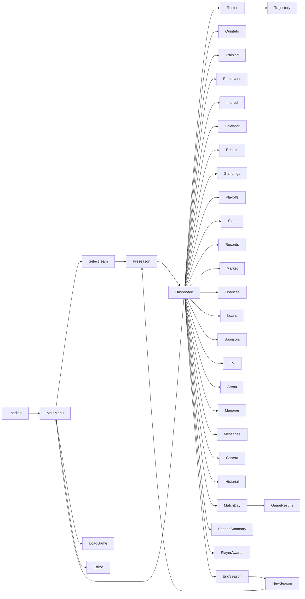
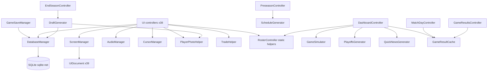

# ARCHITECTURE — Tactical Five

> Facts are marked **[F]**, reasonable deductions **[D]**, hypotheses **[H]**. Line references point to files in `Assets/_TacticalFive/`.

## 1. High-level architecture

Tactical Five is a **data-driven, single-scene, UI-Toolkit-first** management game with no playable match gameplay. Its architecture can be summarized in three layers:

```
┌─────────────────────────────────────────────────────────────────────────┐
│  UI LAYER — UI Toolkit (38 screen controllers + 2 injected components)  │
│  MainMenu.unity (single scene, ~40 UIDocument GameObjects)              │
│  ScreenManager (navigates by toggling SetActive)                        │
├─────────────────────────────────────────────────────────────────────────┤
│  LOGIC LAYER — static utility classes (pure, no state)                  │
│  GameSimulator · DraftGenerator · ScheduleGenerator · PlayoffsGenerator │
│  TradeHelper · QuickNewsGenerator · PlayerPhotoHelper · CustomSlider    │
│  + MonoBehaviour singletons: AudioManager · CursorManager              │
├─────────────────────────────────────────────────────────────────────────┤
│  DATA LAYER — SQLite (sqlite-net)                                       │
│  DatabaseManager (singleton, single gateway) · GameSaveManager (static) │
│  ~40 table model classes (SQLite attributes) · seeders · migrations     │
└─────────────────────────────────────────────────────────────────────────┘
```

**Key architectural decisions (observed):**
- **[F]** One scene; no `SceneManager.LoadScene` calls anywhere in `Assets/_TacticalFive/Scripts` (verified by grep). Screens are GameObjects with `UIDocument`, shown/hidden by `ScreenManager.ShowOnly`. — `ScreenManager.cs:1-247`, `EditorBuildSettings.asset`
- **[F]** No prefabs and no game ScriptableObjects. All runtime data lives in SQLite. — see `PREFABS.md`, `SCRIPTABLE_OBJECTS.md`
- **[F]** No C# event bus / no messaging framework. Cross-system communication is done via (a) the SQLite `messages` table, (b) static mutable state (`GameResultCache`, `ScreenManager.SelectedPlayerId/CurrentMode`), (c) `PlayerPrefs` for settings, and (d) UI Toolkit callbacks. — see `EVENTS.md`
- **[F]** All database access goes through `DatabaseManager.Instance` (a `MonoBehaviour` singleton). No other script opens its own connection except the editor flow via `GameSaveManager`. — `DatabaseManager.cs:30-70`
- **[F]** Simulation is **non-deterministic**: `UnityEngine.Random` is used without seeding throughout (`GameSimulator`, `QuickNewsGenerator`, relationships, AI trades). Exception: `DatabaseManager.GeneratePositionAttrs` uses a seeded `System.Random`. — `GameSimulator.cs`, `DatabaseManager.cs:2013`

## 2. Module inventory

| Module | Files | Responsibility |
|---|---|---|
| **Navigation** | `ScreenManager.cs`, `GameEnums.cs`, `FullScreenUI.cs` | Screen enum, show/hide documents, global selected player / game mode |
| **Persistence** | `DatabaseManager.cs` (5609 ln), `GameSaveManager.cs`, `SQLite.cs`/`SQLiteAsync.cs`, `SaveSlotInfo.cs` | Tables, queries, migrations, seeding, slots/template |
| **Simulation** | `GameSimulator.cs` (732 ln) | Possession-by-possession match sim, stats, injuries, fatigue |
| **Season generation** | `ScheduleGenerator.cs`, `PlayoffsGenerator.cs`, `DraftGenerator.cs` | 82-game schedule + All-Star; Play-In/Playoffs; draft lottery + class |
| **Salary/trades** | `TradeHelper.cs` | Cap constants, trade validation, luxury tax, AI accept evaluation |
| **Economy** | `FinanceRecord.cs`, `LoanData.cs`, `SponsorData.cs`, `TvChannelData.cs`, `TeamSettingsData.cs` | Budget, ticket/subscription, sponsors, TV, loans, renovations (logic in controllers) |
| **Personnel** | `EmployeeData.cs`, `ScoutData.cs`, `CoachRankingData.cs` | Staff hiring/firing, scouting, coaching rankings |
| **Soft stats** | `PlayerPersonalityData.cs`, `PlayerRelationshipData.cs`, `TrainingData.cs`, `LineupData.cs` | Personalities, relationships, training, rotations |
| **Media** | `MessageData.cs`, `QuickNewsGenerator.cs`, `TvChannelData.cs` | Inbox, news generation |
| **UI controllers** | `Scripts/UI/*.cs` (38) | One per screen; bind UXML, load data, handle clicks |
| **Reusable UI** | `HeaderController.cs`, `SidebarController.cs`, `CustomSlider.cs` | Injected header/sidebar; custom slider control |
| **Assets** | `Art/Resources/*`, `UI/*` | Textures, audio, fonts, UXML/USS, panel settings |

## 3. Singletons

Common pattern: `public static X Instance { get; private set; }` + guard in `Awake` (destroy duplicates).

| Singleton | Auto-create | `DontDestroyOnLoad` | Notes |
|---|---|---|---|
| `AudioManager` | **Yes** — `[RuntimeInitializeOnLoadMethod(BeforeSceneLoad)]` creates a GameObject `"AudioManager"` | Yes | Also loads volumes/quality from `PlayerPrefs` and plays menu music |
| `ScreenManager` | No (GameObject `ScreenManager` in scene) | **Not explicit** — it only survives because the co-located `CursorManager` runs `DontDestroyOnLoad` on the shared GameObject (see Risk R1) | Holds 39 serialized `UIDocument` refs |
| `CursorManager` | No (GameObject `CursorManager` **and** a second instance inside `ScreenManager` GameObject) | Yes | Duplicate instance is a known fragility (Risk R1) |
| `DatabaseManager` | No (on `ScreenManager` GameObject) | Yes | Opens no DB in `Awake`; slot init is driven by UI flow |

**Static state (non-singleton):**
- `GameResultCache` — `LastGameDay`, `SimulatedGameIds`, `GameStarters`, `PendingBudgetWarning` (volatile, in-memory). — `GameResultCache.cs`
- `ScreenManager.SelectedPlayerId`, `ScreenManager.CurrentMode`, `ScreenManager.CurrentScreen`.
- `DatabaseManager.Db`, `DatabaseManager.ActiveSaveSlot`, `DatabaseManager.TemplateDbPath`.

## 4. Initialization / lifecycle

```
[Bootstrap]
[RuntimeInitializeOnLoadMethod(BeforeSceneLoad)]
AudioManager.Init() → creates GameObject "AudioManager" (DontDestroyOnLoad)
    ├─ Awake: singleton, creates 2 AudioSources, LoadSettings, TryPlayMusic("backgroundMenu")
    └─ Start: retries music if not playing

[Scene: MainMenu.unity loads]
Active GameObjects with scripts (order not guaranteed, by hierarchy):
    ├─ ScreenManager.Awake → singleton → auto-discovers loadingDocument if null → ShowOnly(Loading)
    ├─ CursorManager.Awake (two instances; one wins) → SetDefaultCursor
    ├─ DatabaseManager.Awake → singleton + DontDestroyOnLoad (no DB work yet)
    └─ FullScreenUI.Awake per document → styles root to absolute full-screen

[First screen]
LoadingController.OnEnable → tip text, click/key/timer(10 s) → GoTo(MainMenu)

[New game]
MainMenuController.OnManagerClicked/OnProManagerClicked
    ├─ GameSaveManager.FindNextAvailableSlot()
    ├─ GameSaveManager.CleanupOrphanDb(slot)
    ├─ DatabaseManager.InitSaveSlot(slot)   ← opens/creates save_N.db, creates tables,
    │                                          runs migrations, clones template.db or seeds
    └─ ScreenManager.GoTo(SelectTeam, GameMode.Manager|ProManager)

[Continue game]
LoadGameController → GameSaveManager.GetAllSlots() → InitSaveSlot(n) + UpdateSlotFromDatabase
```

Detailed per-phase doc: see `SCENES.md` (single scene) and `SAVE_SYSTEM.md` (slot init).

## 5. Navigation model

- `GameScreen` enum (39 values, `GameEnums.cs`) maps 1:1 to serialized `UIDocument` fields on `ScreenManager`.
- `GoTo(screen, mode)`:
  1. Sets `CurrentMode` if `mode != None`.
  2. Sets `CurrentScreen`.
  3. `switch` → `ShowOnly(document)` → iterates all 39 docs, `SetActive(false)`, then `SetActive(true)` on target.
- Screens are **never destroyed**; each controller re-binds everything in `OnEnable`.
- **[F] Anomalies:** `GameScreen.Settings` has **no** `case` and **no** document → dead enum value; `GameScreen.LegalNotice` maps to the *same* `UIDocument` as MainMenu (legal notice is a modal inside `MainMenu.uxml`). — `ScreenManager.cs`, `MainMenu.unity` serialization



## 6. Dependency map (class-level)



Legend: solid = direct call; the biggest coupling is every controller → `DatabaseManager.Instance`.

## 7. Shared helper patterns

- **[F]** Controllers load team logos as dictionaries:
  `Resources.LoadAll<Sprite>("Teams/Logos/{32|64|80|120}x{...}")` then lookup by `TeamData.logo`. Repeated verbatim in many controllers.
- **[F]** `_manager`, `_myTeam`, `_season`, `_allTeams` are fetched in `OnEnable`/`LoadData` of nearly every screen.
- **[F]** Config modal (master/music/sfx sliders + quality + exit/back confirmations) is **copy-pasted** across ~all controllers and both in UXML and USS (`Dashboard.uss`, `MainMenu.uss`, `Roster.uss`, …). This is the single biggest duplication in the codebase.
- **[F]** Currency formatting `$X,XXX,XXX` via `:N0` / `:N0 $`.

## 8. Open questions

- Why `GameMode.ProManager` exists if it has no code-level difference? ([H] intended for a stricter mode)
- Whether the "Editor" template flow is a developer tool or an intended user feature.
- Whether `SQLiteAsync.cs` was legacy from a previous "async loading" design. (See `TODO_TECHNICAL_DEBT.md`.)
