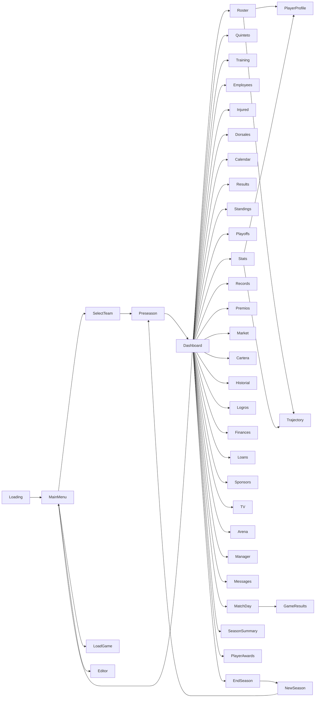

# ARCHITECTURE — Tactical Five

> Facts are marked **[F]**, reasonable deductions **[D]**, hypotheses **[H]**. Line references point to files in `Assets/_TacticalFive/`.

## 1. High-level architecture

Tactical Five is a **data-driven, single-scene, UI-Toolkit-first** management game with no playable match gameplay. Its architecture has three layers:

```
┌─────────────────────────────────────────────────────────────────────────┐
│  UI LAYER — UI Toolkit (41 UIDocument screens + 2 injected components) │
│  MainMenu.unity (single scene, 41 screen GameObjects)                   │
│  ScreenManager (navigates by toggling SetActive)                        │
│  UIScreenController (base class: header/sidebar/nav/config injection)   │
├─────────────────────────────────────────────────────────────────────────┤
│  LOGIC LAYER — static utility classes (pure, no state)                  │
│  GameSimulator · DraftGenerator · ScheduleGenerator · PlayoffsGenerator │
│  TradeHelper · QuickNewsGenerator · PlayerPhotoHelper · ObjectiveHelper │
│  MatchupPreview · AdvancedStatsHelper · FogOfWarHelper · HallOfFameHelper│
│  AchievementService · CustomSlider                                      │
│  + MonoBehaviour singletons: AudioManager · CursorManager               │
├─────────────────────────────────────────────────────────────────────────┤
│  DATA LAYER — SQLite (sqlite-net)                                       │
│  DatabaseManager (singleton, partial classes ×9) · GameSaveManager      │
│  ~45 table model classes (SQLite attributes) · seeders · migrations     │
│  background threads (Task.Run + WAL + AsyncLocal ambient connection)    │
└─────────────────────────────────────────────────────────────────────────┘
```

**Key architectural decisions (observed):**
- **[F]** One scene; no `SceneManager.LoadScene` calls anywhere in `Assets/_TacticalFive/Scripts` (verified by grep). Screens are GameObjects with `UIDocument`, shown/hidden by `ScreenManager.ShowOnly`. — `ScreenManager.cs:217-262`, `EditorBuildSettings.asset`
- **[F]** No prefabs and no game ScriptableObjects. All runtime data lives in SQLite. — see `PREFABS.md`, `SCRIPTABLE_OBJECTS.md`
- **[F]** No C# event bus / no messaging framework. Cross-system communication is done via (a) the SQLite `messages` table, (b) static mutable state (`GameResultCache`, `ScreenManager.SelectedPlayerId/CurrentMode/CurrentScreen`), (c) `PlayerPrefs` for settings, and (d) UI Toolkit callbacks. — see `EVENTS.md`
- **[F]** All database access goes through `DatabaseManager.Instance` (a `MonoBehaviour` singleton split into partial classes). No other script opens its own connection except the editor flow via `GameSaveManager`/`EnsureTemplateDb`. — `DatabaseManager.cs:11-53`
- **[F]** Heavy database batches run on background threads with a per-thread SQLite connection (WAL) exposed via `AsyncLocal` — see §7. — `DatabaseManager.cs:16-28,90-142`

## 2. Module inventory

| Module | Files | Responsibility |
|---|---|---|
| **Navigation** | `ScreenManager.cs`, `GameEnums.cs`, `UIScreenController.cs`, `FullScreenUI.cs` | Screen enum, show/hide documents, global selected player / game mode, base controller |
| **Persistence** | `DatabaseManager.cs` + 8 partials (`DatabaseManager.{Teams,Players,Staff,Manager,Games,Seeding,Records,Achievements}.cs`), `GameSaveManager.cs`, `SQLite.cs`, `SaveSlotInfo.cs` | Tables, queries, migrations, seeding, slots/template, background-thread execution |
| **Simulation** | `GameSimulator.cs` (936 ln) | Possession-by-possession match sim, stats, injuries, fatigue, play-by-play capture |
| **Season generation** | `ScheduleGenerator.cs`, `PlayoffsGenerator.cs`, `DraftGenerator.cs` | 82-game schedule + All-Star; Play-In/Playoffs; draft lottery + class |
| **Salary/trades** | `TradeHelper.cs` | Cap constants, trade validation, luxury tax, AI accept evaluation, pick bonus |
| **Economy** | `FinanceRecord.cs`, `LoanData.cs`, `SponsorData.cs`, `TvChannelData.cs`, `TeamSettingsData.cs` | Budget, ticket/subscription, sponsors, TV, loans, renovations (logic in controllers) |
| **Personnel** | `EmployeeData.cs`, `ScoutData.cs`, `CoachRankingData.cs` | Staff hiring/firing, scouting, coaching rankings |
| **Soft stats** | `PlayerPersonalityData.cs`, `PlayerRelationshipData.cs`, `TrainingData.cs`, `LineupData.cs` | Personalities, relationships, training, rotations |
| **Legacy/history** | `HallOfFameData`/`HallOfFameSeeder`/`HallOfFameHelper`, `RetiredNumberData` + 2 seeders, `PalmaresSeeder`, `TeamRecordSeeder`, `HistoricalPlayerStatsSeeder`, `GmAchievementData` | HOF, retired numbers, palmarés, records, achievements |
| **Media** | `MessageData.cs`, `QuickNewsGenerator.cs`, `TvChannelData.cs` | Inbox, news generation |
| **Analytics/forecast** | `Stats/AdvancedStatsHelper.cs`, `Stats/FogOfWarHelper.cs`, `Stats/MatchupPreview.cs` | eFG%/TS%/PER, scout fog-of-war, pre-match forecast |
| **UI controllers** | `Scripts/UI/*.cs` (41, all inheriting `UIScreenController` in Core) | One per screen; bind UXML, load data, handle clicks |
| **Reusable UI** | `HeaderController.cs`, `SidebarController.cs` (static helpers), `CustomSlider.cs` | Injected header/sidebar; custom slider control |
| **Assets** | `Art/Resources/*`, `UI/*` | Textures, audio, fonts, UXML/USS, panel settings |

## 3. Singletons

Common pattern: `public static X Instance { get; private set; }` + guard in `Awake` (destroy duplicate).

| Singleton | Auto-create | `DontDestroyOnLoad` | Notes |
|---|---|---|---|
| `AudioManager` | **Yes** — `[RuntimeInitializeOnLoadMethod(BeforeSceneLoad)]` creates a GameObject `"AudioManager"` | Yes | Also loads volumes/quality from `PlayerPrefs` and plays menu music |
| `ScreenManager` | No (GameObject `ScreenManager` in scene) | **Yes** (`ScreenManager.cs:64`) | Holds 41 serialized `UIDocument` refs |
| `CursorManager` | No (GameObject `CursorManager` in scene) | Yes | **Single instance** (the old duplicate was removed) |
| `DatabaseManager` | No (co-located on the `ScreenManager` GameObject) | Yes | Opens no DB in `Awake`; slot init is driven by UI flow |

**Static state (non-singleton):**
- `GameResultCache` — `LastGameDay`, `SimulatedGameIds`, `GameStarters`, `PlayByPlayLogs`, `PendingBudgetWarning`, `FastSimTargetDate` (volatile, in-memory). — `GameResultCache.cs`
- `ScreenManager.SelectedPlayerId`, `ScreenManager.CurrentMode`, `ScreenManager.CurrentScreen`.
- `DatabaseManager.Db`, `DatabaseManager.ActiveSaveSlot`, `DatabaseManager.TemplateDbPath`, `DatabaseManager._ambientDb` (AsyncLocal).

## 4. Initialization / lifecycle

```
[Bootstrap]
[RuntimeInitializeOnLoadMethod(BeforeSceneLoad)]
AudioManager.Init() → creates GameObject "AudioManager" (DontDestroyOnLoad)
    ├─ Awake: singleton, creates 2 AudioSources, LoadSettings, TryPlayMusic("backgroundMenu")
    └─ Start: retries music if not playing

[Scene: MainMenu.unity loads]
Active GameObjects with scripts (order not guaranteed, by hierarchy):
    ├─ ScreenManager.Awake → singleton + DontDestroyOnLoad → ShowOnly(Loading)
    ├─ CursorManager.Awake (single instance) → SetDefaultCursor
    ├─ DatabaseManager.Awake → singleton + DontDestroyOnLoad (no DB work yet)
    └─ FullScreenUI.Awake per document → styles root to absolute full-screen

[First screen]
LoadingController.OnEnable → tip text, click/key/timer(10 s) → GoTo(MainMenu)

[New game]
MainMenuController.OnManagerClicked                  (Manager, direct)
MainMenuController.OnProManagerClicked → OpenProModal  (ProManager: restrictions modal)
MainMenuController.ConfirmProManager                  (ProManager: CONTINUAR → runs the flow below)
    ├─ GameSaveManager.FindNextAvailableSlot()
    ├─ GameSaveManager.CleanupOrphanDb(slot)
    ├─ DatabaseManager.InitSaveSlot(slot)   ← opens/creates save_N.db, PRAGMA journal_mode=WAL,
    │                                          CreateTables(), RunMigrations(), clones template.db
    └─ ScreenManager.GoTo(SelectTeam, GameMode.Manager|ProManager)

[Continue game]
LoadGameController → GameSaveManager.GetAllSlots() → InitSaveSlot(n) + UpdateSlotFromDatabase
```

Detailed per-phase doc: see `SCENES.md` (single scene) and `SAVE_SYSTEM.md` (slot init).

## 5. Navigation model

- `GameScreen` enum (**41 values**, `GameEnums.cs`) maps 1:1 to serialized `UIDocument` fields on `ScreenManager` (`ScreenManager.cs:8-49`). Verified: every enum value has a `case` in `GoTo` and every case maps to a distinct document. No dead enum values remain.
- `GoTo(screen, mode)`:
  1. Sets `CurrentMode` if `mode != None`.
  2. Sets `CurrentScreen`.
  3. `switch` → `ShowOnly(document)` → iterates all 41 docs, `SetActive(false)`, then `SetActive(true)` on target.
- Screens are **never destroyed**; each controller re-binds everything in `OnEnable` (via the `UIScreenController` base pipeline).
- `GameScreen` values: Loading, MainMenu, SelectTeam, Preseason, Dashboard, Roster, Calendar, Standings, Palmares, Results, Playoffs, Stats, Records, Market, Finances, Loans, Sponsors, TV, Arena, Messages, MatchDay, GameResults, LoadGame, Employees, Injured, Cartera, SeasonSummary, PlayerAwards, Quintos, EndSeason, NewSeason, Editor, Historial, Training, Quinteto, Dorsales, Manager, Trajectory, Premios, PlayerProfile, Logros.



## 6. Dependency map (class-level)

```mermaid
flowchart TD
    DB[DatabaseManager] --> SQLITE[(SQLite sqlite-net)]
    GSS[GameSaveManager] --> DB
    SC[ScreenManager] --> UI[UIDocument x41]
    UI_C[UI controllers x40] --> USC[UIScreenController base]
    USC --> DB
    USC --> SC
    USC --> AM[AudioManager]
    USC --> CM[CursorManager]
    USC --> HDR[HeaderController / SidebarController static]
    UI_C --> PH[PlayerPhotoHelper]
    UI_C --> TH[TradeHelper]
    DASH[DashboardController] --> SIM[GameSimulator]
    DASH --> PLAY[PlayoffsGenerator]
    DASH --> QNG[QuickNewsGenerator]
    DASH --> CACHE[GameResultCache]
    DASH --> ASVC[AchievementService]
    DASH --> OH[ObjectiveHelper]
    MATCHDAY[MatchDayController] --> CACHE
    MATCHDAY --> MP[MatchupPreview]
    GAMERES[GameResultsController] --> CACHE
    CARTERA[CarteraController] --> FOG[FogOfWarHelper]
    PP[PlayerProfileController] --> FOG
    PP --> ASA[AdvancedStatsHelper]
    STATS[StatsController] --> ASA
    PALMARES[PalmaresController] --> HOF[HallOfFameHelper]
    ENDSEA[EndSeasonController] --> DRAFT[DraftGenerator]
    DRAFT --> DB
    NEWSEA[NewSeasonController] --> DB
```



Legend: solid = direct call; the biggest coupling is every controller → `DatabaseManager.Instance`.

## 7. Async database execution (background threads)

**Problem:** `SQLite.cs` is synchronous-only (no `SQLiteAsyncConnection`). Heavy batches would stutter the main thread.

**Solution (verified, `DatabaseManager.cs:16-28,90-142`):**
- `_ambientDb` is a `static AsyncLocal<SQLiteConnection>`. The `Db`/`_db` property getter returns `_ambientDb.Value ?? _dbField`, so any helper called inside a background delegate automatically resolves to the background thread's own connection.
- `RunInBackground(work)` — opens a fresh connection, runs `work(conn)` directly (used by the daily injury/fatigue recovery batch; no WAL pragma).
- `RunInBackgroundAsync(work)` / `RunInBackgroundAsync<T>` — `Task.Run` → opens its own connection with `PRAGMA journal_mode=WAL`, sets the ambient connection, runs the work, restores the previous ambient in `finally`.
- **Thread-safe RNG:** `[ThreadStatic] private static System.Random _threadRng;` (`DatabaseManager.cs:158-161`); `Rng` gives each background thread its own seeded instance. Used in `StartNewSeason` (attribute decline), player-option decisions, mentoring.
- **Off-main-thread today:** daily injury/recovery batch (`DashboardController.cs:772`), AI trades + star-FA signings + psychologist (`:864`, `ProcessAIMarket`), and the full `StartNewSeason` rollover (`NewSeasonController.cs:375`).
- **Stays on main thread (intentional):** `GameSimulator.SimulateGame` (measured fast) and draft generation.

**Risks [D]:** helpers that capture `_db` in a closure before the ambient is set would still hit the main connection; Unity API (`Random.Range`, `Debug.Log`, `PlayerPrefs`) must not be called on background threads — the code keeps those on the main path.

## 8. Transactions

| Flow | Where | Pattern |
|---|---|---|
| `SaveRegularSeasonGames` | `Games.cs:113-126` | `BeginTransaction`/`Commit`/`Rollback` |
| `SavePlayInGames` | `Games.cs:253` | `RunInTransaction` |
| `SavePlayoffGames` | `Games.cs:264` | `RunInTransaction` |
| `SeedPlayers` / `SeedFreeAgents` | `Seeding.cs:630,1048` | `BeginTransaction` |
| **`StartNewSeason`** | `Records.cs:2570-3070` | single giant transaction wrapping the whole rollover |
| Day processing (steps 2/4) | `DashboardController.cs:846,969,1627,1962,3130` | manual `BeginTransaction`/`Commit` |
| Injury/fatigue recovery batch | `DashboardController.cs:775-805` | inside `RunInBackground` |

## 9. Shared helper patterns

- **[F]** Controllers load team logos as dictionaries: `Resources.LoadAll<Sprite>("Teams/Logos/{64}x{64}")` then lookup by `TeamData.logo`. Repeated in `UIScreenController.RefreshHeader` and several controllers.
- **[F]** `_manager`, `_myTeam`, `_season` are fetched by the `UIScreenController.LoadData` base method; screens override only when they need more.
- **[F]** The config modal (master/music/sfx sliders + quality + sim-mode toggle + exit/back confirmations) is **centralized in `UIScreenController`** (`InitConfigModal`/`OpenConfigModal`/`CloseConfigModal`), eliminating the old per-screen copy-paste. `MainMenuController` overrides the modal to use `style.display` instead of the base's CSS classes.
- **[F]** Currency formatting `$X,XXX,XXX` via `:N0` / `:N0 $`.

## 10. Open questions

- `GameMode.Editor` is dead code — revive or remove? [H] dev-tool leftover.
- The `UIScreenController.LoadSidebarIcons` method runs before the sidebar is attached, so it is effectively dead (sidebar icons are loaded by `SidebarController.LoadIcons` after insertion). Cleanup candidate.
- `FullScreenUI.Awake` duplicates `UIScreenController.MakeFullscreen` — redundant, cleanup candidate.
