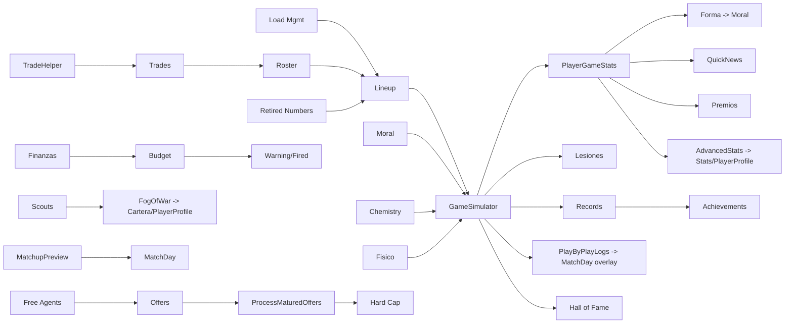

# GAMEPLAY — Tactical Five Mechanics

> Every mechanic with its goal, implementation, data, and exact formulas extracted from code. **[F]** fact, **[D]** deduction, **[H]** hypothesis. Version analyzed: HEAD `1d88989` (2026-08-11).

---

## 1. Season structure

| Phase (`SeasonData.phase`) | When | Produced by |
|---|---|---|
| `preseason` | After team selection, before regular season | `SelectTeamController` → `PreseasonController` |
| `regular` | Oct 22 → Apr 15, 82 games/team | `ScheduleGenerator.GenerateSchedule` (fired by `PreseasonController` when `generated==0`) |
| `playin` | 7-8 and 9-10 seeds per conference, then eliminator | `PlayoffsGenerator.GeneratePlayIn` / `CreatePlayInEliminator` |
| `playoff` | 4 rounds, best-of-7, 2-2-1-1-1 | `PlayoffsGenerator.GeneratePlayoffs` / `AdvancePlayoffSeries` |
| `finished` | Season over | Dashboard phase transition → `EndSeason` → `Draft` → `NewSeason` |

**Calendar facts:** season start date `Oct 22 of year_start`, end Apr 15; trade deadline reminder on Feb 1; **Deadline Day modal on Feb 7** (intercepts btnAction, once per season: IR AL MERCADO / CERRAR, does not advance the day); All-Star window Feb 8–14; up to 15 games/day; no back-to-backs by design (though real ones can appear); ≤5 games/team/week. — `ScheduleGenerator.cs`, `DashboardController.cs`

## 2. Match simulation (core mechanic)

**Script:** `GameSimulator.cs` (936 ln). **Data:** `GameData`, `PlayerData` (11 attributes + `morale` + `fisico`), `LineupData` (rotation). **DTOs:** `PlayerStatSnapshot`, `TeamStats`, `PlayByPlayEvent`, `StatDelta`, `PossessionOutcome`, `GameResult`.

### Team ratings
- Player rating = `clamp(overall + (morale − 50) * 0.1, 0, 99)`.
- Team rating = mean player rating (all healthy players, not only starters).
- Home bonus: `+1.5` court factor; chemistry: home ×0.15, away ×0.10.
- `pace = clamp(101 + (homeRating + awayRating − 140) * 0.06 + rand(−2, 2), 95, 107)`.

### Possession model (`RunPossession`, :505-586)
- Turnover probability: `0.11 + (defR − offR) * 0.0003`.
- Shooter selection: weighted by `(overall/100)^2.2 * FisicoPenalty`, where `FisicoPenalty = 1` if `fisico ≥ 30`, else `0.75 + (fisico/30)*0.25`.
- Shot type by position: PG 40% / SG 46% / SF 38% / PF 33% / C 18% from three, adjusted `+ (three_point − 75)*0.002`, clamped 0.10–0.55, × FisicoPenalty.
- Defense: best `defense` on the floor; `di = (defense − 70) * 0.005`.
- 3PT FG%: `clamp((0.35 + (three_point−70)*0.005) * fp − di, 0.28, 0.51)`.
- 2PT FG%: `clamp((0.50 + (shooting−70)*0.005) * fp − di*0.25, 0.40, 0.67)`.
- And-one: 6% on made 2; 75% FT. Foul on miss: 18% (3pt) / 14% (2pt), 3 FTs on 2P 10% of the time; `ftPct = 0.75 + (overall−70)*0.002`.
- Blocks: `clamp((blocks−60)/400, 0, 0.10)` per defender.
- Rebounds: defensive `sum(reb^3)` vs offensive `sum(reb^2.5)`; per-player winner weighted by `reb^3`.
- Assists: 35% chance, passer weight `passing^3`.
- Turnovers: handler PG/SG/SF weighted `1/FisicoPenalty`; only 50% become steals, steal weight `steals_attr^3`.
- Fouls: random C/PF on court.

### Quarters, rotations, overtime
- 4 quarters via `SimQuarter`; `teamPoss = clamp(round(pace/4 * rand(0.96,1.04)), 22, 28)` per team per quarter.
- Rotations via `SubSchedule` (Q1/Q3 subs at 4' and 8'; Q2/Q4 at 2',5',8',10.5'). Overtime: 24 possessions (`minsPerPoss = 5/24`), sub at 2.5'. Up to 5 OTs.
- Substitution policy: 75% skill-based / 25% random (`DoSub`); rosters >12 (All-Star) rotate the bench randomly.

### Elite floors
If `minutes ≥ 20`: `passing ≥ 95` → assists floor `round(min/48*10)`; `rebounding ≥ 95` → boards floor `round(min/48*10)` (split oreb/dreb half/half); `steals ≥ 90` → steals floor `round(min/48*3)`; `blocks ≥ 95` → blocks floor `round(min/48*3)`. — `GameSimulator.cs:168-189`

### Rating & double-double
`rating = points + oreb + dreb + ast + stl + blk − (fga−fgm) − (fta−ftm) − to − pf`. ≥3 categories of 10+ → triple-double; ≥2 → double-double. — `GameSimulator.cs:191-205`

### Persisted outputs
- `PlayerGameStats` rows per player; `GameData` updated (scores, quarters, `is_played=1`).
- Records checked (`CheckAndUpdateRecords`; skipped for All-Star).
- Fatigue: `fisico -= round(minutes*0.25)` (×1.5 on true back-to-back via `game_day-1` check), floor 0; recovered +8/day.
- Injuries: base prob 0.008/game, multiplied by `1 + (30−fisico)*0.15` when `fisico < 30`; 27 weighted types (see `SYSTEMS.md §S12`).

### Play-by-play en vivo (Vista de Partido)
- Toggle **Vista de Partido** en los modales de Configuración: `Directa` (0) o `Play-by-play` (1), persistido en `PlayerPrefs TF_SimMode` (`UIScreenController.GetSimMode()`). Solo aplica al flujo día a día (no fast sim).
- `GameSimulator` captura la crónica sin alterar el resultado: `PlayByPlayEvent` (quarter, texto en español, marcador acumulado, `timeElapsed`, deltas `StatDelta` por jugador). `CaptureBox`/`DiffBox` generan los deltas tras cada posesión + minutos por jugador; hay meta-eventos de inicio de cuarto/prórroga y fin de partido. Solo se guarda en `GameResultCache.PlayByPlayLogs[game.id]` cuando `GetSimMode()==1`.
- Overlay inmersivo en `MatchDay`: nombres + logos, marcador acumulado, reloj `mm:ss`, barra de progreso 0–100%, **boxscore en vivo** por equipo (12 columnas) reordenado por VAL descendente y totales recalculados desde los jugadores.
- Velocidades **x1/x3/x5/x10** (persistidas en `TF_PbpSpeed`; base 2 s/evento) y botón **SALTAR** (avanza al final reconstruyendo el boxscore; al acabar cambia a **IR AL RESUMEN**). — `MatchDayController.cs`

### Previa / pronóstico (Matchup Preview)
`MatchupPreview.Compute(home, away, isHome, managerId, seasonId)` (`Stats/MatchupPreview.cs`): calcula ratings de equipo (misma fórmula que el simulador + bonus de química y casa) + **forma reciente** (`(avgRating − 50) * 0.25` sobre los últimos 5 partidos jugados) → probabilidad de victoria `1/(1+exp(−diff*0.08))`. Declara FAVORITO solo si `|prob−0.5| > 0.005`. Estrellas = top 3 OVR de cada equipo. Se muestra en `MatchDayController.ShowMatchupPreview` (entre el banner y el boxscore).

### Fallback
If a team has <2 available players, result is random-ish (105–125 vs 100–120) with `DistributeQuarters` (partition into 4 balanced quarters).

## 3. Lineups & rotations

- `LineupData.slot`: 0 = starter, 1 = bench, 2 = inactive. `slot_index` orders them.
- `AutoSeedLineup` builds a default rotation (starters by position, bench by role).
- `GetActivePlayers(teamId)` returns the active 12 used in simulation (starters first → `GameResultCache.GameStarters`).
- Dashboard pre-game checks: empty starter slots, injured starters, and **load management** open modal prompts.
- **Load management** (`DashboardController.cs:899-923`): if `TF_LoadMgmt_Enabled` (PlayerPrefs, toggled in `QuintetoController`) and the team has a real back-to-back, the modal lets you rest up to 2 tired players (bench/inactive for one game); `_loadMgmtIsB2B`/`_loadMgmtTiredPlayers`.
- **Simulación rápida** (`CalendarController` → "SIMULAR HASTA FECHA"): `FastSimRoutine` (`DashboardController.cs:1324`) avanza días con `ProcessGameDayRoutine(fastSim:true)`; spinner gira continuo, botón **DETENER** activo; pausa ante ofertas maduradas (modal IR A QUINTETO / SEGUIR SIMULANDO) y traspasos entrantes (`ShowNextPendingTradeOffer`); al terminar modal "SIMULACIÓN COMPLETADA".
- All-Star rosters: `BuildAllStarRoster("East"|"West")`.

## 4. Contracts & salary cap

Constants (2025-26, `TradeHelper.cs:7-14`): cap `174,647,000`, luxury `220,428,000`, 1st apron `229,015,000`, 2nd apron `241,686,000`, NT-MLE `14.1M`, T-MLE `5.7M`, minimum `2M`, max roster 17. Cap, luxury and aprons **+5% per season** (`StartNewSeason`).

### Max offer (`RosterController.GetMaxOfferBreakdown`)
1. `maxByExp`: experience = `max(0, age − 22)`; ≤6yr → `cap × 25%`, ≤9yr → `cap × 30%`, else `cap × 35%`.
2. Own-team renewal tiers by `seasons_with_team`: ≥3 → full Bird → `maxByExp`; 2 → Early Bird → `max(salary×1.75, cap×10.5%)`; else → Non-Bird → `salary×1.20`.
3. **External FA: `birdMax = 0`** (no Bird rights). **FA propio reciente** (`IsOwnRecentFA`: `team_id==0 && last_team_id==myTeam && seasons_with_team>0`) → Bird rights.
4. `capSpaceMax = salary + max(0, cap − payroll)`.
5. Over cap: exceptions only — ≤1st apron → NT-MLE (ProManager: **Taxpayer MLE only**), ≤2nd apron → T-MLE, else minimum.
6. `finalMax = min(maxByExp, rawMax)`.

### Offer resolution (`ProcessMaturedOffers`, after 7 days)
Acceptance via `CalculateAcceptScore` (see `SYSTEMS.md §S9`); roll `Random(1,101) ≤ score`. Legality re-checked at maturity. **Contract options:** TO/PO toggles (mutually exclusive) on renewal and FA offers → `guaranteed_years = max(0, offer_years − 1)`; `FormatContractYears` renders `3 años (Team Option)` / `2 años + Player Option` in messages.

### Trades (`TradeHelper.ValidateTrade` / `EvaluateTrade`)
Apron rules (2nd apron: no aggregation, incoming ≤ outgoing; 1st apron: ≤110%; else `2×+250K` / `+7.5M` / `125%+250K`). Picks tradable (`draft_picks.current_team_id`) with **protection & swaps** (`protected_from`, `is_swap`, `swap_original_team_id`; `PickBonus` devalues protected picks). S&T of own FA via `MarketController.ProcessSATrade` (Bird max → sign + immediate trade → two `TradeData`; receiver under hard cap; `teamASignSalaries`/`teamBSignSalaries` in validation).

### Cap sheet (Finances → «CAP SHEET»)
Read-only projection: current payroll vs cap/apron/space, per-year committed payroll (5 yrs at +5%/season), expiring players (`contract_years==1` → FA), available exceptions, luxury tax and 2nd apron.

## 5. Economy

### Income per home game (`ProcessGameFinances`)
- `attendance = CalculateAttendance(...)` (formula in `SYSTEMS.md §S8`).
- `ticketRevenue = attendance × ticket_price × arenaMultiplier` (by PABELLON staff reputation 1.03–1.20).
- Sponsor `home_game_income` and TV `home_game_income` added if contract active.
- All recorded as `FinanceRecord` (types 1/3/4) and added to `TeamData.budget`.

### Monthly
- `ProcessMonthlyPayroll` on `payrollDays = {1,31,61,91,121,151,181}`: player salaries `sum/12` (type 7) + employees `sum/12` (type 8), each guarded against double-pay per day. **Luxury tax on the same days** (`ProcessTeamLuxuryTax`): `annualTax = CalculateLuxuryTax(sum(player salaries), luxury_threshold)`; if >0 deduct `annual/12` (type 10). — `DashboardController.cs:5032-5153`
- `ProcessSubscriptionRevenue` (game days 10–12 ≈ Nov 1): `numSubscribers = clamp(capacity * (0.5 + (2000 − subscription_price)/10000) * (1 + wins_first4*0.05) * (0.7 + reputation/5*0.6) * rand(0.85–1.15), 0, capacity)`; income = subscribers × price (type 2).

### One-off
- **Arena renovations** (`ArenaController`): Grada General +3000/$10M/3wk; Tribuna +2000/$20M/5wk; VIP +1000/$35M/8wk; discounted by PABELLON reputation (0.80–0.97); max capacity 50,000.
- **Loans** (`LoansController`): amount/debt/interest/monthly payment (type 9).
- **Luxury tax** (`TradeHelper.CalculateLuxuryTax`): brackets above threshold — `(5M,1.5),(5M,1.75),(5M,2.5),(5M,3.25),(∞,3.75)`; charged monthly `annual/12` (type 10).
- **Buyout with stretch** (`RosterController.ConfirmBuyout`): `remaining = salary × contract_years`; `stretchYears = contract_years × 2`; `annual = remaining/stretchYears` (last year takes remainder); player → FA; TYPE_BUYOUT (11) records per year.
- **Budget warnings:** budget red 3+ times (2 in ProManager) → fired modal (`CheckBudgetWarning`).
- **Sponsors/TV renegotiation:** max 3 sponsors, max 3 TV; `initial_income` + `home_game_income`; contracts in years.

## 6. Roster management

- **Renewals** (`RosterController`): salary spinner 1M..max, years 1–5; TO/PO toggle buttons; `GetMaxOfferBreakdown` shown; warnings over luxury tax.
- **Dismissal / buyout** (`RosterController`): `DESPEDIR` (type 6 severance) / `RESCINDIR CONTRATO` (stretch buyout).
- **FA market** (`MarketController`): FAs sorted by `GetCalculatedAverage()` desc; salary/years spinners; accept-score preview; TO/PO toggles; legality enforced. **Fog-of-war** in evaluation for un-scouted FAs (see §13).
- **Trade block** (`RosterController`): `players.on_trade_block` — mark players as TRANSFERIBLE; shown in Market.
- **Trajectory / PlayerProfile**: player career + season stats screens.

## 7. Training

Assign player+attribute, `duration_days`; `ProcessTraining()` completes them on game days; `CompleteTrainingAndApply` adds +2 to the attribute (reflection) and recalculates `overall` (cap `potential`).

## 8. Soft systems

### Morale (0–100)
Per-game delta (clamped −3..+3): role minutes satisfaction (Estrella 40', Titular 28', Banquillo 10', Último 3') + form (avg last-5 rating: ≥28→+2 … ≤10→−2) + streak (win%≥0.7→+1, ≤0.3→−1) + contract (1yr→−1) + injury (−2). Morale <20 → complaint messages; <10 → demands trade. (`UpdatePlayersMoraleAfterGame`)

### Fan confidence (0–100)
Win: +4 home / +2 away (+1 if margin ≤5 or ≥20). Loss: −3 home / −2 away (−1 if margin ≤5 or ≥20). (`UpdateFanConfidence`)

### Team chemistry
`CalculateTeamChemistry(teamId, gameDay)` recomputed after games for involved teams; seeded personalities/relationships evolve with games (`UpdateRelationshipsAfterGame`); affects simulations and accept scores.

### Personality & relationships
8 personality types; relationship `bond` 1–99 between player pairs; seeded per team; evolved after games.

### Injuries & fatigue
Fatigue lowers performance (`FisicoPenalty`) and raises injury risk; injured players skip sims; recovery +8/day with inbox messages; psychologist (staff) affects morale.

## 9. League AI

- `ProcessAITransfers` (cycle every ≥10 game days, **3-5 game days during deadline week Feb 1-8**; transfer window Sep 1–Feb 8): AI teams fill weak spots — <12 players sign FA; otherwise attempt an AI trade (max 3 per cycle). Each team has a **strategy** (`TeamStrategy`: Contend / Balanced / Rebuild via `GetTeamStrategy`): Contend (top 4 conference or 2+ stars OVR≥85) denser (0.45, 6-day cooldown), hunts upgrades up to OVR 90 including a future pick, protects young (age<26, OVR≥82); Rebuild (bottom 4 or young without stars) sells veterans ≥30 for young/picks (`TrySellVeteran`), 8-day cooldown; Balanced 15-day cooldown. Offers to the player strategy-aware (`PickTradeTarget`/`BuildOfferPackage`). Deadline contenders offer extra picks; titles prefixed `[DEADLINE]`.
- `ProcessStarFreeAgentSignings`: top FAs (avg > 80) sign with strongest teams; priority Contend > Balanced > Rebuild; Rebuild never signs OVR≥85.
- `EndSeasonController.ProcessAITeamRenewals`: AI renews its expiring players.
- `StartNewSeason` refills AI rosters to 15 (best teams first), trims to 17 max, aging/progression, +5% caps, re-signs TV/sponsors.

## 10. Draft

- 60 picks (2 rounds), lottery odds NBA 2024+ (`{0.140×3, 0.125, 0.105, 0.090, 0.075, 0.060, 0.045, 0.030, 0.020, 0.015, 0.010, 0.005}`), class quality roll (weak −3 / normal / strong +2 / historic +4), generational talents, procedural rookies (attributes, salaries by tier, 4-year contracts, jersey via `AssignJerseyNumber`, rookie photos). `EndSeasonController` runs it; `NewSeasonController` continues. Picks resolve protections and swaps via `BuildSlotOwners`.

## 11. Awards, records, legacy & progression

- Monthly awards (Manager/Jugador/Rookie del Mes) via `EvaluateMonthlyAwards` (1st of Dec–Apr).
- Season-end records: `SaveSeasonEndRecords` (MVP, ROY, best defender, sixth man, most improved, All-NBA/rookie quintets, All-Star teams, finals MVP, champion).
- **Player honor counters** (`players.*`, migrated, default 0): `rings` (+1 campeón), `finals_mvps` (+1 MVP Finales = mejor rating medio del campeón), `finals_played` (+1 a ambos finalistas), `season_mvps` (+1 MVP regular con ≥65 partidos). Shown in `PlayerProfile`/`Trajectory` headers (CAMPEONATOS / FINALES / MVP / MVP FINALS).
- **Season quintets** (`QuintosController`): "Mejor Quinteto" (All-Star) + "Mejor Quinteto de Rookies" (5 players each, one per position by primary *or* secondary, min 65 games, best avg rating, regular games only). Note: **only the first team** is produced (`GetBestPerPosition`, `DatabaseManager.Records.cs:1857`).
- **Hall of Fame** (`HallOfFameHelper`): induction if 1 ring OR 1 Finals MVP OR ≥30k pts OR ≥15k reb OR ≥10k ast (career totals). Candidates = retiring players (age ≥40) who `WouldInduct`; inducted in `StartNewSeason` (`TryInductIntoHallOfFame`); ~100 preloaded legends from `HallOfFameSeeder`. Displayed in `Palmares` (HOF panel) and `EndSeason` (Fame panel).
- **Retired numbers** (`DorsalesController`): seed of 53 legends + 17 active veterans (`RetiredNumberSeeder`/`VeteranRetiredNumberSeeder`); `ShouldRetireNumber` (WouldInduct + seasons_with_team ≥10); `TryRetireNumber` at retirement; `AssignJerseyNumber` reserves retired numbers (1–99, avoids taken). Screen shows current roster numbers + retired.
- Career stats archived per season (`UpdateHistoricalPlayerStatsFromSeason`, `player_season_stats`).
- Records: historical + team + season single-game via `CheckAndUpdateRecords`; **record-break achievements** hooked inside it.
- Aging/progression (`StartNewSeason`): band deltas + **position-based athletic decline** (athletic attributes decline faster by position/age) + **mentoring** (veterans boost young players), retirements ≥40, contract expiry → FA.

## 12. Player values & role

- `PlayerRole` thresholds: seed players ≥88 Estrella / ≥78 Titular / ≥68 Banquillo; FAs lower (≥80/≥70/≥60).
- `overall` = mean of 11 attributes (cap potential), recomputed everywhere.
- `secondary_position` = adjacent position (PG→SG, SF→PF, PF→C, C→PF); **SG toma Base si `height_cm < 198` y Alero si `≥ 198`** (migration `UPDATE`, `DatabaseManager.cs:405-424`).

## 13. Fog of war (ojeadores)

`FogOfWarHelper` (`Stats/FogOfWarHelper.cs`, `BAND_WIDTH = 5`):
- `CanViewRatings(player, myTeamId, scoutedIds)`: visible if player is on your team or in your `scoutedIds`.
- Hidden → OVR shown as a **range band** `{low}-{low+5}` (deterministic offset per player `(id*2654435761 % 5)`), role hidden (`?`), and the 11-attribute grid replaced by a "attributes locked" panel. Season/advanced stats remain visible.
- Scouts: completing a scout adds the player to `scoutedIds`; the scout card reveals all 11 attributes + salary + contract years. Scout duration by reputation: 5→3d, 4→5d, 3→8d, 2→12d, 1→16d, else 20d.
- Consumers: `CarteraController` (FA market), `PlayerProfileController`.

## 14. Advanced analytics

`AdvancedStatsHelper`: **eFG%** `(fgm + 0.5*fg3m)/fga*100`; **TS%** `points / (2*(fga + 0.44*fta)) * 100`; **PER** `eff/minutes * 48` (simple per-48 efficiency, not the canonical formula); `CalcEff` = `pts+reb+ast+stl+blk − (fga−fgm) − (fta−ftm) − tov`. Shown in `Stats` (league leaders) and `PlayerProfile` (season cards).

## 15. GM achievements (Logros)

- Persisted per slot in `gm_achievements` (`UNIQUE(manager_id, type)`, `INSERT OR IGNORE` idempotent).
- **28 logros** en 6 categorías (Primeros Pasos, Temporada, Jugador Premiado, Playoffs, Carrera, Mercado) — catálogo en `AchievementCatalog.All`.
- Hooks: `EvaluateGameDay` (partido/victoria/rachas/victorias temporada), `EvaluateSeasonEnd` (playoffs/campeonato/bicampeón/dinastías/premios/hitos carrera), `EvaluateSignStarFA`/`EvaluateSignAndTrade`/`EvaluateTradeStar` (mercado), `EvaluateRecordBreak` (récords). `BackfillCareer` silencioso al abrir Logros.
- Toast de desbloqueo en el Dashboard (cola `_pendingToasts`, consumida en `Update`).
- UI: `Logros` con tabs por categoría, grid de 6 columnas y contador `X/total`.

---

## Cross-mechanic interaction diagram

## Open questions

- Does the psychologist actually accelerate injury recovery via `treated`? `ProcessPsychologistMorale` suggests morale-only [H].
- `GetBestPerPosition` only produces the FIRST All-Star/Rookie quintet — is a second team intended? [H] The UI labels say "Mejor Quinteto de la Temporada".
- `MatchupPreview.RecentFormBonus` only considers the manager's team's last-5 games for both sides (away teams use the same manager's context). Possible imprecision [D].
