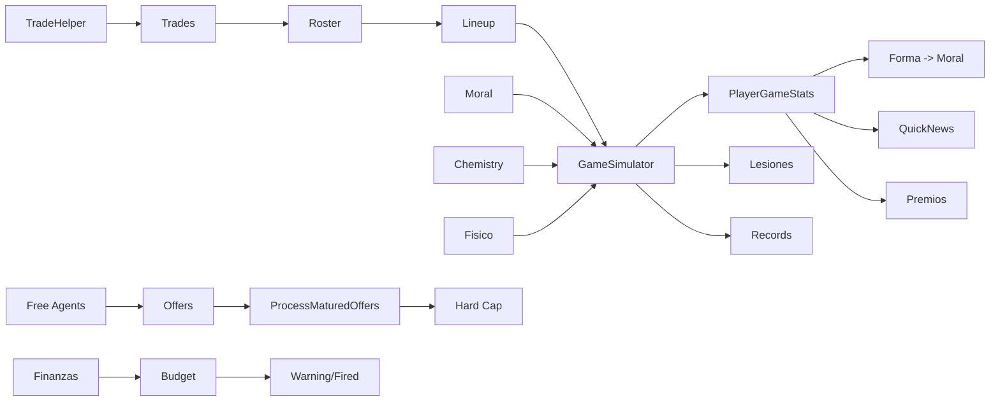

# GAMEPLAY — Tactical Five Mechanics

> Every mechanic with its goal, implementation, data, and exact formulas extracted from code. **[F]** fact, **[D]** deduction, **[H]** hypothesis.

---

## 1. Season structure

| Phase (`SeasonData.phase`) | When | Produced by |
|---|---|---|
| `preseason` | After team selection, before regular season | `SelectTeamController` → `PreseasonController` |
| `regular` | Oct 22 → mid-April, 82 games/team | `ScheduleGenerator.GenerateSchedule` (fired by `PreseasonController` when `generated==0`) |
| `playin` | 7-8 and 9-10 seeds per conference, then eliminator | `PlayoffsGenerator.GeneratePlayIn` / `CreatePlayInEliminator` |
| `playoff` | 4 rounds, best-of-7, 2-2-1-1-1 | `PlayoffsGenerator.GeneratePlayoffs` / `AdvancePlayoffSeries` |
| `finished` | Season over | Dashboard phase transition → `EndSeason` → `Draft` → `NewSeason` |

**Calendar facts:** season start date `Oct 22 of year_start`; trade deadline reminder on Feb 1; **Deadline Day modal on Feb 7** (intercepts btnAction, once per season: IR AL MERCADO / CERRAR, does not advance the day); All-Star window Feb 8–14; up to 15 games/day; no back-to-backs by design. — `ScheduleGenerator.cs`, `DashboardController.cs`

## 2. Match simulation (core mechanic)

**Script:** `GameSimulator.cs`. **Data:** `GameData`, `PlayerData` (11 attributes + `morale` + `fisico`), `LineupData` (rotation).

### Team ratings
- Player rating = `overall + (morale − 50) * 0.1`.
- Team rating = mean player rating.
- Home bonus: `+1.5` court factor; chemistry: home ×0.15, away ×0.10.
- `pace = Clamp(101 + (homeRating + awayRating − 140) * 0.06 + rand(−2, 2), 95, 107)`.

### Possession model (`RunPossession`)
- Turnover probability: `0.11 + (defR − offR) * 0.0003`.
- Shooter selection: weighted by `(overall/100)^2.2 * FisicoPenalty`, where `FisicoPenalty = 1` if `fisico ≥ 30`, else `0.75 + (fisico/30)*0.25`.
- Shot type by position: PG 40% / SG 46% / SF 38% / PF 33% / C 18% from three, adjusted by the player's `three_point`.
- Defense: best `defense` on the floor; factor `(def − 70) * 0.005` applied to the shooter's FG%.
- FG% clamps: three-pointers `0.28–0.51`, two-pointers `0.40–0.67`.
- And-one: 6% chance on made shots. Foul on miss: 18% (3pt) / 14% (2pt), possible 3 FTs.
- Rebounds: `DoReb`/`AwardReb` weighted by `rebounding`; turnovers `DoTO` (only 50% yield a steal); fouls `DoFoul` prefer C/PF.

### Quarters, rotations, overtime
- 4 quarters via `SimQuarter`; rotations by `SubSchedule` (Q1/Q3 subs at 4' and 8'; Q2/Q4 at 2',5',8',10.5'). Overtime: 24 possessions, sub at 2.5'. Up to 5 OTs.
- Possessions per quarter: `Clamp(pace/4 * rand(0.96,1.04), 22, 28)`.
- Substitution policy: 75% skill-based / 25% random (`DoSub`), bench and All-Star-aware.

### Elite floors
If `minutes ≥ 20`: `passing ≥ 95` → minimum assists; `rebounding ≥ 95` → minimum rebounds; `steals ≥ 90` / `blocks ≥ 95` → minimum steals/blocks. — `GameSimulator.cs`

### Persisted outputs
- `PlayerGameStats` rows per player (points, boards, assists, blocks, steals, TOs, PF, rating, double/triple doubles).
- `GameData` updated (scores, quarters, `is_played=1`).
- Records checked (`CheckAndUpdateRecords`; skipped for All-Star).
- Fatigue: `fisico -= minutes * 0.25` (×1.5 on true back-to-back), floor 0; recovered daily.
- Injuries: base prob 0.008/game, multiplied up to ×5.5 when `fisico < 30`; 27 weighted types (1–300 days).
- `rating` = player game score; `double_double`/`triple_double` flags.

### Play-by-play en vivo (Vista de Partido)
- Toggle **Vista de Partido** en los modales de Configuración (Dashboard/MainMenu): `Directa` (resultado instantáneo) o `Play-by-play`. Persistido en `PlayerPrefs TF_SimMode` (`UIScreenController.GetSimMode()` / `SimModePrefKey`, 0=Directa, 1=Play). Solo aplica al flujo día a día (no fast sim).
- `GameSimulator` captura la crónica sin alterar el resultado: `PlayByPlayEvent` (quarter, text en español, `homeScore`/`awayScore` acumulados, `timeElapsed`, deltas `StatDelta` por jugador). `RunPossession`/`MissHandler` devuelven `PossessionOutcome` con la descripción; `DoAst/DoReb/AwardReb/DoTO/DoFoul` devuelven el nombre del jugador. `CaptureBox`/`DiffBox` generan los deltas tras cada posesión + minutos por jugador en pista; hay meta-eventos de inicio de cuarto/prórroga y fin de partido.
- `DashboardController.ProcessSingleGame` rellena `GameResultCache.PlayByPlayLogs[game.id]` cuando el modo es Play.
- Overlay inmersivo en `MatchDay` (`PlayByPlayOverlay`): nombres + logos de equipos, marcador acumulado, reloj `mm:ss`, barra de progreso 0–100% por tiempo real del partido, y **boxscore en vivo** por equipo (12 columnas) que se reordena por **VAL descendente** en cada evento y cuya fila de TOTALES se **recalcula desde los jugadores** (`RecalcTotals`) en cada actualización.
- Velocidades **x1/x3/x5/x10** (persistidas en `TF_PbpSpeed`; base 2 s/evento) y botón **SALTAR**: durante el partido avanza al final (reconstruyendo el boxscore completo); al acabar cambia a **IR AL RESUMEN** y cierra el overlay para mostrar el MatchDay con el resumen final (marcador, boxscore y asistencia). — `MatchDayController.cs`

### Fallback
If a team has <2 available players, result is random-ish (105–125 vs 100–120) with `DistributeQuarters`.

## 3. Lineups & rotations

- `LineupData.slot`: 0 = starter, 1 = bench, 2 = inactive. `slot_index` orders them.
- `AutoSeedLineup` builds a default rotation (starters by position, bench by role).
- `GetActivePlayers(teamId)` returns the active 12 used in simulation (starters first → `GameResultCache.GameStarters`).
- Dashboard pre-game checks: empty starter slots and injured starters open **modal prompts** that can redirect the user to the Quinteto screen. — `DashboardController.ProcessGameDayRoutine:762-790`
- **Simulación rápida** (`CalendarController` → botón "SIMULAR HASTA FECHA"): confirma, navega al Dashboard y `FastSimRoutine` avanza días con `ProcessGameDayRoutine(fastSim: true)` hasta la fecha objetivo o fin de temporada. Auto-simula todos los partidos (incluidos los del equipo); cada día se procesa por trozos con `yield return null` entre partidos/pre-lote/química (mismos transactions atómicos), por lo que el spinner del header gira continuo y el botón **DETENER SIMULACIÓN** está activo en todo momento con cursor hand; la parada se aplica al terminar el día en curso (se conserva el día simulado y no se muestra el modal de resumen). La navegación del sidebar queda deshabilitada durante la sim. Tras cada día recarga `_players`/`_allGames` y llama `Refresh()` para que la fecha del header y los paneles (partidos, clasificación, estadísticas, relaciones, noticias) avancen en vivo. Si hay quinteto incompleto/lesionados se muestra el modal de quinteto: la opción **automática** arregla la alineación y **reanuda la simulación** desde el mismo día (sin re-ejecutar el pre-lote ya commiteado), mientras que la opción manual lleva a Quinteto y detiene la sim. **Pausa por ofertas:** al final de cada día en modo `fastSim`, si hay ofertas maduradas (renovaciones/fichajes) o propuestas de traspaso pendientes, la simulación se detiene en ese punto (el día ya está commiteado y no se duplica al reanudar). Las ofertas maduradas muestran un modal con dos botones — **IR A QUINTETO** (azul: detiene la simulación y navega a Quinteto) y **SEGUIR SIMULANDO** (verde: reanuda); los traspasos entrantes se muestran vía `ShowNextPendingTradeOffer` — RECHAZAR reanuda la simulación y ACEPTAR la detiene (como DETENER). Al terminar la simulación (salvo DETENER o aceptar un traspaso) se muestra un resumen simplificado: solo el título "SIMULACIÓN COMPLETADA" en verde con un botón CERRAR. En el flujo día a día (sin fast sim), el modal de ofertas/renovaciones muestra un único botón CERRAR en azul.
- All-Star rosters: `BuildAllStarRoster("East"|"West")`.

## 4. Contracts & salary cap

Constants (2025-26, `TradeHelper.cs`): cap `174,647,000`, luxury `220,428,000`, 1st apron `229,015,000`, 2nd apron `241,686,000`, NT-MLE `14.1M`, T-MLE `5.7M`, minimum `2M`, max roster 17. Cap, luxury and aprons **+5% per season** (`StartNewSeason`).

### Max offer (`RosterController.GetMaxOfferBreakdown`)
1. `maxByExp`: experience = `max(0, age − 22)`; ≤6yr → `cap × 25%`, ≤9yr → `cap × 30%`, else `cap × 35%`.
2. Own-team renewal tiers by `seasons_with_team`:
   - ≥3 → full Bird → `maxByExp`
   - 2 → Early Bird → `max(salary × 1.75, cap × 10.5%)`
   - else → Non-Bird → `salary × 1.20`
3. **External FA: `birdMax = 0`** (no Bird rights).
4. `capSpaceMax = salary + max(0, cap − payroll)`.
5. If external FA and `payroll > cap`: exceptions only — `≤1st apron` → NT-MLE, `≤2nd apron` → T-MLE (`capSpaceMax=0`), else minimum.
6. `finalMax = min(maxByExp, rawMax)`.

### Offer resolution (`ProcessMaturedOffers`, after 7 days)
Acceptance probability via `CalculateAcceptScore` (see `SYSTEMS.md §S9`); roll `Random(1,101) ≤ score`. Results: accepted → player signs/renews (sets `team_id`, `salary`, `contract_years`, `guaranteed_years`, `has_team_option`, `has_player_option`, `seasons_with_team=1` for FAs; cooldowns), rejected → cooldown (+14/15 days). Legality re-checked at maturity: over-cap signings only legal up to the applicable exception; **NT-MLE usage sets hard cap** (`first_apron_hard_capped=1`). Contract outcomes in the inbox and the summary modal now show the options: e.g. `3 años (Team Option)`, `2 años + Player Option` (helper `FormatContractYears`). **Re-firma de FA propio**: si un jugador que declinó su player option (FA reciente con `last_team_id == myTeam`) es re-firmado, la rama renovación le reasigna `team_id`; si mientras maduraba firmó con otro equipo, la re-firma se cancela.

### Trades (`TradeHelper.ValidateTrade` / `EvaluateTrade`)
Both sides validated against apron rules (2nd apron: no aggregation, incoming ≤ outgoing; 1st apron: ≤110% of outgoing; else standard matching `2×+250K` / `+7.5M` / `125%+250K`). AI accept via `EvaluateTrade` score vs threshold (see `SYSTEMS.md §S7`). Picks can be traded (`draft_picks.current_team_id`). User-initiated trades live in `MarketController`; AI-initiated offers appear as modals via `ShowNextPendingTradeOffer`.

### Sign-and-Trade (S&T) de FA propio — `MarketController`
Junto a los jugadores del equipo, el panel de traspaso muestra la sección **"FA RECIENTES (BIRD RIGHTS) — SIGN & TRADE"**: tus FA propios (`IsOwnRecentFA`) con su salario máximo Bird (`GetMaxOfferBreakdown(isFromSameTeam:true)`). Al seleccionarlos y confirmar, `ProcessSATrade` los **firma** (Bird rights) y los **traspasa de inmediato** al equipo rival a cambio de jugadores/picks; el receptor queda bajo hard cap del 1er apron. Se registran dos `TradeData` (`free_agent` de la firma + `sign_and_trade` del traspaso). `ValidateTrade`/`EvaluateTrade` aceptan `teamASignSalaries`/`teamBSignSalaries` para valorar el nuevo salario firmado (sin descontar roster/nómina del equipo que firma). La IA puede proponer S&T por tu FA propio (`GenerateAITradeOffersForPlayer` → `ShowNextPendingTradeOffer`) y respeta `pendingSATIds` para no robártelo en sus fichajes.

### Cap sheet (Finances → «CAP SHEET») — `FinancesController.BuildCapSheet`
- **Summary boxes**: current payroll (sum of `players.salary`), cap and apron from `LeagueSettings` (fallback `TradeHelper`), space = cap − payroll.
- **Projection to 5 years (including current) at +5%/season** (`ProjectedCap`, mirroring `StartNewSeason`): per year shows cap, committed payroll and space (color-coded green/amber/red).
- **Yearly committed payroll**: a player contributes `salary` for the current year and each year while `contract_years > yr` (years remaining; flat salary model), dropping the further out the contract expires.
- **Expiring players**: `contract_years == 1` → become FA at season end (`team_id=0`).
- **Available exceptions**: NT-MLE / T-MLE / minimum plus luxury tax and 2nd apron. Read-only for now.

## 5. Economy

### Income per home game (`ProcessGameFinances`)
- `attendance = CalculateAttendance(...)` (formula in `SYSTEMS.md §S8`).
- `ticketRevenue = attendance × ticket_price × arenaMultiplier` (arenaMultiplier by PABELLON staff reputation 1.03–1.20).
- Sponsor `home_game_income` and TV `home_game_income` added if contract active (years remaining > 0).
- All recorded as `FinanceRecord` (types 1/3/4) and added to `TeamData.budget`.

### Monthly
- `ProcessMonthlyPayroll` runs only on **payroll days** (`payrollDays = {1, 31, 61, 91, 121, 151, 181}`, ≈ monthly): player salaries as expense (`sum(salary)/12`, type 7) and employee salaries (`sum/12`, type 8), each guarded against double-pay per day. **Luxury tax evaluated on the same days** — if no TYPE_TAX record for the day: `annualTax = CalculateLuxuryTax(sum(player salaries), luxury_threshold)`; if > 0 deduct `annualTax / 12` and record type 10. — `DashboardController.cs:3659-3763`
- `ProcessSubscriptionRevenue` (game days 10–12 ≈ Nov 1, once per season): `numSubscribers = clamp(capacity * (0.5 + (2000 − subscription_price)/10000) * (1 + wins_first4*0.05) * (0.7 + reputation/5*0.6) * rand(0.85–1.15), 0, capacity)`; income = subscribers × price (type 2). — `DashboardController.cs:3767-3827`

### One-off
- **Arena renovations** (`ArenaController`): 3 tiers (Grada General +3000/$10M/3wk; Tribuna +2000/$20M/5wk; VIP +1000/$35M/8wk); cost discounted by PABELLON reputation (0.80–0.97); capped at 50,000 capacity; max 3 renovations before `facilities` bump.
- **Loans** (`LoansController`): amount/debt/interest/monthly payment; recorded as type 9.
- **Luxury tax** (`TradeHelper.CalculateLuxuryTax`): progressive brackets above luxury threshold — `(5M,1.5),(5M,1.75),(5M,2.5),(5M,3.25),(∞,3.75)`; charged monthly as `annual/12` (type 10). — implemented at `DashboardController.cs:3741`
- **Buyout with stretch provision** (`RosterController.OpenBuyoutModal/ConfirmBuyout`): `remaining = salary × contract_years`; `stretchYears = contract_years × 2`; `annual = remaining / stretchYears` (last year takes remainder); player released to FA (`team_id=0`); each year recorded as a TYPE_BUYOUT finance record (type 11); inbox message shows payment schedule. — implemented at `RosterController.cs:1583-1654`
- **Sponsors/TV renegotiation** (`SponsorsController`/`TVController`): 3 active sponsors max, TV max 3; `initial_income` + `home_game_income`; contracts in years.
- **Budget warnings:** if budget goes negative 3+ times → fired modal (`CheckBudgetAfterGame`/`CheckBudgetWarning`, `budget_red_warnings`).

## 6. Roster management

- **Renewals** (`RosterController`): salary spinner 1M..max, years 1–5; warning when payroll exceeds luxury tax; `GetMaxOfferBreakdown` shown; **optional TO/PO toggle buttons** (team option / player option, mutually exclusive; option years reduce guaranteed years by 1); offer persisted in `offers` with `guaranteed_years`/`has_team_option`/`has_player_option`.
- **Dismissal / buyout** (`RosterController`): `DESPEDIR`/`RESCINDIR CONTRATO` buttons on player detail. Dismissal: severance recorded (finance type 6). Buyout (`ConfirmBuyout`): stretch provision implemented (see §5) with TYPE_BUYOUT records.
- **FA market** (`MarketController`): `FreeAgentsPanel`, salary/years spinners, accept-score preview (`UpdateFAAcceptScore`), legality enforced via `GetMaxOfferBreakdown(..., isFromSameTeam:false)`. The free agent list is shown **sorted by descending calculated average** (`GetCalculatedAverage`) after fetching from `GetFreeAgents()`. The contract offer modal includes the same **TO/PO toggle buttons** as renewals (`ToggleFAOption`/`RefreshFAOptionToggles`), so FA signings can carry team/player options too. Los FA recientes de tu equipo (que declinaron su player option, `last_team_id == myTeam`) conservan **Bird rights** (`isFromSameTeam=true`) al firmarles.
- **Re-firma de FA propio** (`NewSeasonController`): tras decidir las player options, si un jugador declinó la suya aparece un modal "RE-FIRMA DE AGENTES LIBRES" con salario previo, valor de mercado (`EstimateMarketSalary`) y máximo con Bird rights; el manager puede enviar una oferta diferida (madura 7 días) o dejarlo salir al mercado.
- **Trajectory** (`TrajectoryController`): player career stats screen (uses `ScreenManager.SelectedPlayerId`).

## 7. Training

- Assign player+attribute, `duration_days`; `ProcessTraining()` completes them on game days; `CompleteTrainingAndApply` adds +2 to the attribute (reflection) and recalculates `overall` (cap `potential`).

## 8. Soft systems

### Morale (0–100)
Per-game delta (clamped −3..+3): role minutes satisfaction + form (avg last-5 rating) + streak + contract-year-1 penalty + injury penalty. Morale < 20 triggers complaint messages; < 10 demands a trade. (`UpdatePlayersMoraleAfterGame`)

### Fan confidence (0–100)
Win: +4 home / +2 away (+1 if margin ≤5 or ≥20). Loss: −3 home / −2 away (−1 if margin ≤5 or ≥20). (`UpdateFanConfidence`)

### Team chemistry
`CalculateTeamChemistry(teamId, gameDay)` recomputed after games for involved teams; seeded personalities/relationships evolve with games (`UpdateRelationshipsAfterGame`); affects simulations and accept scores.

### Personality & relationships
8 personality types; relationship `bond` 1–99 between player pairs; seeded per team; evolved after games.

### Injuries & fatigue
Fatigue lowers performance (`FisicoPenalty`) and raises injury risk; injured players skip sims; recovery daily with inbox messages; `treated` flag / psychologist role for faster treatment [H].

## 9. League AI

- `ProcessAITransfers` (cycle every ≥10 game days, reduced to 3-5 game days during deadline week Feb 1-8, `IsDeadlineWeek`; transfer window Sep 1–Feb 8): AI teams fill weak spots — <12 players sign FA; otherwise attempt an AI trade (max 3 per cycle). Each team has a **strategy** (`TeamStrategy`: Contend / Balanced / Rebuild via `GetTeamStrategy`): Contend (top 4 conference or 2+ stars OVR≥85) is denser (0.45 chance, 6-day cooldown) and hunts upgrades up to OVR 90 including a future pick, protecting its young (age<26, OVR≥82); Rebuild (bottom 4 or young roster without stars) sells veterans ≥30 for young players/picks (`TrySellVeteran`), 8-day cooldown; Balanced keeps the classic behavior (15-day cooldown). Offers to the player are strategy-aware (`PickTradeTarget`/`BuildOfferPackage`): Contend chases stars (OVR≥83), Rebuild hunts young assets. Star FA signings prioritize Contend > Balanced > Rebuild, and Rebuild never signs OVR≥85 (protects its draft pick). Contenders (top 4 conference, `IsTeamContender`) offer draft picks more aggressively during deadline week. Trade offer titles prefixed with `[DEADLINE]`.
- `ProcessStarFreeAgentSignings`: top FAs (avg > 80) sign with the strongest teams (by roster average), respecting pending user offers [D].
- `EndSeasonController.ProcessAITeamRenewals`: AI renews its expiring players.
- `StartNewSeason` refills AI rosters to 15 (best teams pick first, positional need), trims to 17 max, aging/progression, +5% caps, new sponsors/TV for teams without contracts (excluding user).

## 10. Draft

- 60 picks (2 rounds), lottery odds NBA 2024+, class quality roll, generational talents, procedural rookies (attributes, salaries by tier, 4-year contracts, rookie photos). `EndSeasonController` runs it; `NewSeasonController` continues.

## 11. Awards, records & progression

- Monthly awards (Manager/Jugador/Rookie del Mes) via `EvaluateMonthlyAwards`.
- Season-end records: `SaveSeasonEndRecords` (MVP, ROY, best defender, sixth man, most improved, All-NBA teams, All-Star teams, finals MVP, champion).
- Career stats archived per season (`UpdateHistoricalPlayerStatsFromSeason`, `player_season_stats`).
- Records: historical + team + season single-game records via `CheckAndUpdateRecords`.
- Aging/progression per season (`StartNewSeason`): band-based attribute deltas, retirements ≥40, contract expiry → FA.

## 12. Player values & role

- `PlayerRole` thresholds: seed players ≥88 Estrella / ≥78 Titular / ≥68 Banquillo; FAs lower (≥80/≥70/≥60).
- `overall` = mean of 11 attributes (cap potential), recomputed everywhere.
- `secondary_position` = adjacent position (PG→SG, SF→PF, PF→C, C→PF); los SG toman Base si `height_cm < 198` y Alero si `≥ 198`.

---

## Cross-mechanic interaction diagram

## Open questions

- Does the psychologist actually accelerate recovery (`treated` flag)? `ProcessPsychologistMorale` suggests morale-only [H].
- `GameMode.ProManager` differences — only worst teams selectable (`SelectTeamController` `GetWorstTeams(5)`) and new-season offers limited to bottom-10 (`NewSeasonController`). Harder cap/firing rules not implemented yet (TODO B20).
