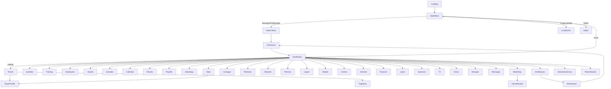

# UI_TOOLKIT — Tactical Five Interface

> Complete analysis of the UI Toolkit stack. **[F]** fact, **[D]** deduction, **[H]** hypothesis. State: HEAD `81d9e4f` (2026-08-16).

## 1. Stack summary

- **Engine:** Unity 6 (6000.3.15f1) UI Toolkit **runtime** (no IMGUI, no uGUI game objects; `com.unity.ugui` present only as package dependency).
- **One panel settings for all screens** (`UI/Resources/TacticalFivePanelSettings.asset`):
  - Render mode: Screen Space Overlay.
  - `m_ScaleMode: ScaleWithScreenSize`, reference 1920×1080, match 0.5, reference DPI 96.
  - `themeUss` → `TacticalFiveTheme.tss` (the only `.tss`) which `@import`s `Styles/GlobalVariables.uss`, `Styles/Typography.uss`, `Styles/Utilities.uss`.
- **Every screen** is a root GameObject with `UIDocument` (same PanelSettings) + `FullScreenUI` + its controller MonoBehaviour. **41 screen GameObjects** in `MainMenu.unity`; only 4 active at boot (MainCamera, ScreenManager, CursorManager, LoadingDocument).
- **Per-screen files:** 42 UXML/USS pairs exist under `UI/Screens/`: 41 operational screens plus the uninstantiated `LegalNotice.uxml`; `LegalNotice.uss` is still imported by MainMenu and other screens. Shared USS references mix `project://database/...` and relative paths, not only GUID-style references.

## 2. Theme & styling architecture

```
TacticalFivePanelSettings.asset (PanelSettings)
 └─ themeUss → TacticalFiveTheme.tss
     └─ @import GlobalVariables.uss   (:root CSS variables — colors, accents, buttons)
     └─ @import Typography.uss        (.text-xs … .text-hero, color/text-align utils)
     └─ @import Utilities.uss         (.flex-*, .p-*, .m-*, .w-full, .rounded-*)
```

- **GlobalVariables.uss** defines `--bg-primary rgb(11,16,23)`, `--bg-secondary`, `--bg-card`, `--bg-modal`, borders, text colors, accents (`--accent-blue/gold/green`), button variables.
- **Typography.uss** sizes 10px→80px; **Utilities.uss** flexbox/spacing helpers.
- **Per-screen USS** overrides; fonts `BarlowCondensed-*` and `Saira_Condensed-*` referenced via `url("project://database/Assets/_TacticalFive/Art/Fonts/...")` with TMP SDF counterparts under `Art/Fonts/*.asset`.

## 3. Reusable components

### Header (`UI/Resources/UI/Core/Header.uxml` + `HeaderController.cs` — static helper)
- Injected at runtime: `Resources.Load<VisualTreeAsset>("UI/Core/Header")` → `template.CloneTree()` appended to the root. — `HeaderController.cs:13`
- Contains: brand ("TF TACTICAL FIVE"), team logo, team/manager name, 4 stat blocks (PRESUPUESTO / MASA SALARIAL / MARGEN / QUÍMICA), season + date, action button (`BtnAction`), config icon (`ConfigIcon`).
- `Attach(root, registerBtnAction)` is **idempotent** (repopulates an existing `TopHeader`; otherwise restructures the container into header + `bodyRow` (sidebar + main) and re-adds modals as absolute children). Default `BtnAction` → `GoTo(Dashboard)`.

### Sidebar (`UI/Resources/UI/Core/Sidebar.uxml` + `SidebarController.cs` — static helper)
- Injected like the header (`Resources.Load<VisualTreeAsset>("UI/Core/Sidebar")`). `Attach(root, activeScreen)` is idempotent; inserts sidebar at index 0; `ApplyActiveState` highlights the current screen; `LoadIcons` loads the 13 nav icons from `Resources/Icons/`.
- **27 nav mappings** (`SidebarController.cs:15-45`) over 13 top-level items + 5 submenus (18 items). Full list in §5. The identical handlers are registered by `UIScreenController.RegisterNavButtons` (13 navs + 18 submenu items, `UIScreenController.cs:138-247`).

### CustomSlider (`Scripts/UI/CustomSlider.cs`)
- Custom slider control (not a native `Slider`) used in the config modals (master/music/SFX). Binds drag to value changes via `OnValueChanged` callback → `AudioManager` volume setters.

## 4. Controller pattern — `UIScreenController` base

**[F] All 41 screen controllers inherit `UIScreenController`** (base in `Scripts/Core/UIScreenController.cs`, 575 ln). The base centralizes:

```csharp
protected virtual void OnEnable()
{
    _doc = GetComponent<UIDocument>();
    _root = _doc.rootVisualElement;
    MakeFullscreen();          // absolute full-screen root
    CacheReferences();         // virtual — bind UXML elements
    LoadSidebarIcons();        // (dead — sidebar loads its own icons)
    LoadData();                // _manager/_myTeam/_season from DB
    RegisterCallbacks();       // sidebar+header attach, BtnAction, RegisterNavButtons, cursors, ConfigIcon
    InitConfigModal();         // config modal wiring
    Refresh();                 // default: RefreshHeader
}
```

**What the base provides (all virtual):**
- `ScreenId` (per-screen enum id), `BtnActionTarget` (default Dashboard).
- **Fullscreen:** `MakeFullscreen` (absolute 0/0/100%/100%). (Redundant with `FullScreenUI.Awake`.)
- **Chrome injection:** `RegisterCallbacks` calls `SidebarController.Attach(_root, ScreenId)` + `HeaderController.Attach(_root, registerBtnAction:false)`, binds `BtnAction` → `PlayClick(); OnBtnActionClicked()`, `RegisterNavButtons()`, `RegisterHandCursors()`, and the config icon → `OpenConfigModal()`.
- **Navigation:** `RegisterNavButtons` wires 13 navs + 18 submenu items (sidebar submenu toggling with `nav-submenu--visible` class).
- **Config modal:** `InitConfigModal`/`OpenConfigModal`/`CloseConfigModal` — 3 `CustomSlider`s (Master/Music/SFX), quality Low/Medium/High/Ultra, **sim-mode toggle** (Directa / Play-by-play, `TF_SimMode`), main-menu confirm overlay, exit confirm overlay. **This replaced the old per-screen copy-paste duplication.**
- `PlayClick()` → `AudioManager.Instance?.PlaySFX("click")`.
- `Refresh()` → default cursor + `RefreshHeader()` (rebuilds the header stat blocks) in try/catch.

**Inheritance quirks (verified):**
- 17 controllers call `base.RegisterCallbacks()`; **12 override `RegisterCallbacks()` WITHOUT base** (Editor, EndSeason, GameResults, LoadGame, MainMenu, MatchDay, NewSeason, PlayerAwards, Preseason, Quintos, SeasonSummary, SelectTeam) — those screens build their own chrome/nav or are standalone (boot/menu/slot screens). The remaining 12 don't override it (base behavior).
- `GameResultsController` re-implements nav/submenu/cursor wiring in its override (references `NavRecords`/`NavSponsors`/`NavTV`, which do **not** exist in `Sidebar.uxml` — null-safe `?.`).
- **Callback lifecycle risk [F]:** screens are disabled with `SetActive(false)` but not destroyed. `OnEnable` calls `RegisterCallback` again and there is no general unregister/guard phase. Repeated navigation may accumulate handlers; confirm with a Unity runtime test before changing the pattern.
- `BtnActionTarget` is never overridden; `OnBtnActionClicked` overridden by `CalendarController` and `DashboardController`.

## 5. Screens inventory (41)

| # | Screen | UXML folder | Controller | Notes |
|---|---|---|---|---|
| 1 | Loading | `Screens/Loading` | `LoadingController` | Boot/tip screen → MainMenu (click/key/10s) |
| 2 | MainMenu | `Screens/MainMenu` | `MainMenuController` | Manager / Pro Manager / Load / Editor / Exit; legal + bug-report + config + ProModal |
| 3 | SelectTeam | `Screens/SelectTeam` | `SelectTeamController` | Pick franchise (mode-aware; ProManager → worst teams only) |
| 4 | Preseason | `Screens/Preseason` | `PreseasonController` | Preseason sim + schedule generation |
| 5 | Dashboard | `Screens/Dashboard` | `DashboardController` | Home hub; day advance, fast sim, modals, toasts, deadline day |
| 6 | Roster | `Screens/Roster` | `RosterController` | Roster + player detail; renew/dismiss/buyout/trade-block; 9 modals |
| 7 | Quinteto | `Screens/Quinteto` | `QuintetoController` | Starting five/rotation + load-management toggle |
| 8 | Training | `Screens/Training` | `TrainingController` | Attribute training |
| 9 | Employees | `Screens/Employees` | `EmployeesController` | Staff hiring/firing |
| 10 | Injured | `Screens/Injured` | `InjuredController` | Injured list + treatment |
| 11 | Dorsales | `Screens/Dorsales` | `DorsalesController` | Retired numbers: tabs Actuales/Retirados |
| 12 | Calendar | `Screens/Calendar` | `CalendarController` | Season schedule + SIMULAR HASTA |
| 13 | Results | `Screens/Results` | `ResultsController` | Game results list |
| 14 | Playoffs | `Screens/Playoffs` | `PlayoffsController` | Playoff bracket |
| 15 | Standings | `Screens/Standings` | `StandingsController` | Conference standings |
| 16 | Stats | `Screens/Stats` | `StatsController` | League stat leaders (+ advanced analytics) |
| 17 | Records | `Screens/Records` | `RecordsController` | Records screen |
| 18 | Palmares | `Screens/Palmares` | `PalmaresController` | Historical palmarés + Hall of Fame panel |
| 19 | Premios | `Screens/Premios` | `PremiosController` | Monthly awards |
| 20 | Logros | `Screens/Logros` | `LogrosController` | GM achievements: tabs + grid + counter |
| 21 | Market | `Screens/Market` | `MarketController` | Trades + FA market (TO/PO toggles, S&T, deadline banner) |
| 22 | Cartera | `Screens/Cartera` | `CarteraController` | Player wallet/contracts + scouts + fog-of-war |
| 23 | Historial | `Screens/Historial` | `HistorialController` | Trade history |
| 24 | Finances | `Screens/Finances` | `FinancesController` | P&L + Cap sheet |
| 25 | Loans | `Screens/Loans` | `LoansController` | Loans |
| 26 | Sponsors | `Screens/Sponsors` | `SponsorsController` | Sponsor deals |
| 27 | TV | `Screens/TV` | `TVController` | TV deals |
| 28 | Arena | `Screens/Arena` | `ArenaController` | Arena management (tickets/subscriptions/renovations) |
| 29 | Manager | `Screens/Manager` | `ManagerController` | Manager profile, morale/fans circles, psychologist, objective |
| 30 | Messages | `Screens/Messages` | `MessagesController` | Inbox |
| 31 | MatchDay | `Screens/MatchDay` | `MatchDayController` | Pre-match (matchup preview) + play-by-play overlay + boxscore |
| 32 | GameResults | `Screens/GameResults` | `GameResultsController` | Post-match box score |
| 33 | LoadGame | `Screens/LoadGame` | `LoadGameController` | Save slots |
| 34 | Editor | `Screens/Editor` | `EditorController` | Editor (template DB) |
| 35 | EndSeason | `Screens/EndSeason` | `EndSeasonController` | Retirees, HOF, expiring, draft |
| 36 | NewSeason | `Screens/NewSeason` | `NewSeasonController` | Post-draft rollover (options, re-signs, decremento de contratos antes del control de plantilla >17, StartNewSeason async) |
| 37 | SeasonSummary | `Screens/SeasonSummary` | `SeasonSummaryController` | Season recap |
| 38 | PlayerAwards | `Screens/PlayerAwards` | `PlayerAwardsController` | Player awards |
| 39 | PlayerProfile | `Screens/PlayerProfile` | `PlayerProfileController` | Player season stats + career + attributes + fog-of-war gate + honors |
| 40 | Quintos | `Screens/Quintos` | `QuintosController` | Season All-Star/Rookie quintets |
| 41 | Trajectory | `Screens/Trajectory` | `TrajectoryController` | Player career |
| 42 | GLeague | `Screens/GLeague` | `GLeagueController` | Liga de desarrollo del equipo: asignados con stats de `gleague_season_stats` + elegibles para asignar (reutiliza `GLeagueHelper`) |

**Sidebar navigation (verified, `SidebarController.cs:15-45`):**
- **INICIO** → Dashboard
- **PLANTILLA** (RosterSubmenu) → Jugadores (Roster), Quinteto, Entrenamiento, Empleados, Lesionados, Dorsales
- **RESULTADOS** → Calendar, Results, Playoffs
- **CLASIFICACIÓN** → Standings
- **LOGROS** (the current `Sidebar.uxml` label for PalmaresSubmenu) → Palmares, Records, Premios
- **ESTADÍSTICAS** → Stats
- **MERCADO** (MarketSubmenu) → Ofertas (Market), Cartera, Historial
- **FINANZAS** (FinanceSubmenu) → Decisiones (Finances), Préstamos (Loans), Patrocinadores (Sponsors), Televisión (TV)
- **PABELLÓN** → Arena
- **MANAGER** (ManagerSubmenu) → Manager, Logros
- **NOTICIAS** → Messages

## 6. Navigation tree



**Navigation mechanics:** `ScreenManager.GoTo(GameScreen, GameMode)` → `ShowOnly(doc)` toggles `SetActive`. Controllers rebuild in `OnEnable`. All 41 enum values have cases; no dead values.

## 7. How screens are created/shown/hidden

- **Created:** statically in the scene (each document is a scene GameObject with UIDocument/FullScreenUI/controller). Nothing is instantiated at runtime except the injected header/sidebar subtrees and procedural rows.
- **Shown:** `SetActive(true)` → `OnEnable` → base pipeline binds chrome + data + callbacks.
- **Hidden:** `SetActive(false)` (no manual teardown). Controllers rely on state being re-fetched each `OnEnable`.
- **Destroyed:** never (except app quit). Everything is rebuilt in `OnEnable`; any external mutation must re-trigger `Refresh()` manually.

## 8. Events used (see EVENTS.md for full table)

`ClickEvent` (all buttons), `KeyDownEvent` (Loading, MainMenu Escape), `MouseEnter/MouseLeave` (cursor via `CursorManager.RegisterHandCursor`), `CustomSlider.OnValueChanged` (drag), `WaitUntil` (modal blocking), `schedule.Execute` (deferred actions, e.g. cursor at +100ms).

## 9. Risks & observations

- **Dead `UIScreenController.LoadSidebarIcons`** — runs before the sidebar is attached; sidebar icons are loaded by `SidebarController.LoadIcons`. Cleanup candidate.
- **Double header population:** base `RefreshHeader` duplicates `HeaderController.Populate`; both execute on each screen load.
- **`GameResultsController`** re-implements nav referencing 3 non-existent sidebar elements (`NavRecords`/`NavSponsors`/`NavTV`) — harmless (null-safe) but confusing.

## Preguntas abiertas

- ¿La acumulación de callbacks se reproduce en todas las pantallas o algunos controles se reemplazan al hacer `CloneTree`?
- ¿Debe eliminarse `LegalNotice.uxml` y conservarse solo el USS compartido, o se pretende convertir el aviso legal en pantalla real?
- ¿La mezcla de rutas USS relativas y `project://database` funciona en todas las plataformas objetivo?
- ¿La resolución mínima soportada es realmente 1920×1080, dado el uso extensivo de tamaños fijos?
- **`FullScreenUI` is redundant** with `UIScreenController.MakeFullscreen`.
- **Manual row building:** no `ListView`/`BindableElement` — rebuilding large lists on every `OnEnable` is cheap here (small datasets) but verbose.
- **Hardcoded 1920×1080** sizing everywhere (sidebar 200px, panels, grid) — no responsive breakpoints; `ScaleWithScreenSize` match 0.5 handles 16:9 mostly.
- **`LegalNotice.uxml`/`.uss`** folder still exists but the LegalNotice screen was removed; MainMenu has the legal modal inline. Orphaned assets.

## 10. Open questions

- Whether `GameResultsController`'s full nav re-implementation (without base) is intentional or leftover from before the base class existed. [H]
- Whether a second All-Star/Rookie quintet (or team) is intended in `Quintos` UI. [H]
