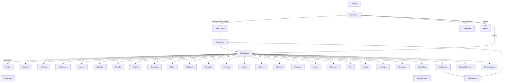

# UI_TOOLKIT — Tactical Five Interface

> Complete analysis of the UI Toolkit stack. **[F]** fact, **[D]** deduction, **[H]** hypothesis.

## 1. Stack summary

- **Engine:** Unity 6 (6000.3.15f1) UI Toolkit **runtime** (no IMGUI, no uGUI game objects; `com.unity.ugui` present only as package dependency).
- **One panel settings for all screens** (`UI/Resources/TacticalFivePanelSettings.asset`):
  - Render mode: Screen Space Overlay.
  - `m_ScaleMode: ScaleWithScreenSize`, reference 1920×1080, match 0.5, reference DPI 96.
  - `themeUss` → `TacticalFiveTheme.tss` (the only `.tss` in the project) which `@import`s `Styles/GlobalVariables.uss`, `Styles/Typography.uss`, `Styles/Utilities.uss`.
- **Every screen** is a root GameObject with `UIDocument` (same PanelSettings) + `FullScreenUI` + its controller MonoBehaviour. There are ~40 such GameObjects in `MainMenu.unity`; only 4 active at boot (MainCamera, ScreenManager, CursorManager, LoadingDocument).
- **Per-screen files:** one folder per screen under `UI/Screens/` containing `<Screen>.uxml` + `<Screen>.uss`. Screens also reuse `Dashboard.uss` and `LegalNotice.uss` for shared modals/styles (referenced via `guid` in UXML `<Style>`).

## 2. Theme & styling architecture

```
TacticalFivePanelSettings.asset (PanelSettings)
 └─ themeUss → TacticalFiveTheme.tss
     └─ @import GlobalVariables.uss   (:root CSS variables — colors, accents, buttons)
     └─ @import Typography.uss        (.text-xs … .text-hero, color/text-align utils)
     └─ @import Utilities.uss         (.flex-*, .p-*, .m-*, .w-full, .rounded-*)
```

- **GlobalVariables.uss** defines `--bg-primary rgb(11,16,23)`, `--bg-secondary`, `--bg-card`, `--bg-modal`, borders, text colors, accents (`--accent-blue/gold/green`), button variables.
- **Typography.uss** sizes 10px→80px; **Utilities.uss** flexbox/spacing helpers.
- **Per-screen USS** overrides; fonts `BarlowCondensed-*` and `Saira_Condensed-*` referenced via `url("project://database/Assets/_TacticalFive/Art/Fonts/...")` with TMP SDF counterparts under `Art/Fonts/*.asset`.

## 3. Reusable components

### Header (`UI/Resources/UI/Core/Header.uxml` + `HeaderController.cs`)
- Injected at runtime: `Resources.Load<VisualElement>`-style — actually `Resources.Load<VisualTreeAsset>("UI/Core/Header")` → `template.CloneTree()` appended to the root. — `HeaderController.cs:13`
- Contains: brand ("TF TACTICAL FIVE"), team logo, team/manager name, 4 stat blocks (PRESUPUESTO / MASA SALARIAL / MARGEN / QUÍMICA), season + date, action button, config icon.

### Sidebar (`UI/Resources/UI/Core/Sidebar.uxml` + `SidebarController.cs`)
- Injected like the header. `Resources.Load<VisualTreeAsset>("UI/Core/Sidebar")`, `Sidebar.uss` attached. — `SidebarController.cs:50`
- 11 nav items with 4 submenus:
  - INICIO → Dashboard
  - PLANTILLA → Jugadores, Quinteto, Entrenamiento, Empleados, Lesionados
  - RESULTADOS → Calendar, Results, Playoffs
  - CLASIFICACIÓN → Standings
  - LIGA → Palmarés (Palmarés, Records, Premios), Stats
  - MERCADO → Ofertas, Cartera, Historial
  - FINANZAS → Decisiones, Préstamos, Patrocinadores, Televisión
  - PABELLÓN → Arena
  - MANAGER, NOTICIAS
- **Not `<ui:Template>`** — plain UXML injected programmatically [F]. `SidebarController.Attach` is called from each screen controller's `OnEnable`.

### CustomSlider (`Scripts/UI/CustomSlider.cs`)
- Custom `Slider` subclass used in the config modals (master/music/SFX). Binds `ChangeEvent<float>` to labels and `AudioManager` volume setters.

## 4. Controller pattern (38 controllers)

**No common base class** [F] — each is a plain `MonoBehaviour`. The convention (repeated in every controller):

```csharp
void OnEnable()
{
    _doc = GetComponent<UIDocument>();
    _root = _doc.rootVisualElement;
    // 1. force absolute full-screen on root
    // 2. CacheReferences()   → root.Q<T>("elementName") for every UI element
    // 3. LoadData()          → DatabaseManager queries into fields (_manager, _myTeam, _season...)
    // 4. RegisterCallbacks() → RegisterCallback<ClickEvent> etc.
    // 5. Refresh()/Build()   → procedural row building (no ListView)
}
```

Notable specifics:
- **No `ListView`**: tables/rosters are built with `VisualElement` rows + `Label`s added via `Clear()` + `Add()`. Scroll containers are `ScrollView`s.
- **Modals**: each screen UXML declares overlay + box elements (`*-overlay`/`*-box`); controllers toggle `style.display` between `Flex`/`None`.
- **Config modal duplication**: the settings modal (3 sliders + quality buttons) and the confirm dialogs (volver al menú / salir) are duplicated in every relevant UXML **and** in every controller — the largest duplication in the project (see `TODO_TECHNICAL_DEBT.md`).
- **Auto-close**: some modals auto-close via coroutine (`WaitForSeconds(5f)` in `RosterController.AutoCloseRenewResult`).
- **Loading**: `LoadingController` shows a random tip from `Tips[]`, waits for click/key or 10 s, then `GoTo(MainMenu)`.
- **Cursor registration**: controllers call `CursorManager.Instance?.RegisterHandCursor(element)` (often deferred 100 ms via `schedule.Execute`).

## 5. Screens inventory

| Screen | UXML folder | Controller | Purpose |
|---|---|---|---|
| Loading | `Screens/Loading` | `LoadingController` | Boot/tip screen → MainMenu |
| MainMenu | `Screens/MainMenu` | `MainMenuController` | Manager / Pro Manager / Load / Editor / Exit; modals (legal, bug report, config, ProManager restrictions) |
| LegalNotice | inside MainMenu | (MainMenuController) | Modal; shares MainMenu UIDocument |
| SelectTeam | `Screens/SelectTeam` | `SelectTeamController` | Pick franchise (mode-aware) |
| Preseason | `Screens/Preseason` | `PreseasonController` | Preseason sim + schedule generation |
| Dashboard | `Screens/Dashboard` | `DashboardController` | Home; last/next game, standings, player stats, board (morale/fans), team stats, messages, day advance |
| Roster | `Screens/Roster` | `RosterController` | Roster list + player detail; renew/dismiss/buyout; 9 modals |
| Quinteto | `Screens/Quinteto` | `QuintetoController` | Starting five/rotation |
| Training | `Screens/Training` | `TrainingController` | Attribute training |
| Employees | `Screens/Employees` | `EmployeesController` | Staff hiring/firing |
| Injured | `Screens/Injured` | `InjuredController` | Injured list + treatment |
| Calendar | `Screens/Calendar` | `CalendarController` | Season schedule |
| Results | `Screens/Results` | `ResultsController` | Game results list |
| Playoffs | `Screens/Playoffs` | `PlayoffsController` | Playoff bracket |
| Standings | `Screens/Standings` | `StandingsController` | Conference standings |
| Stats | `Screens/Stats` | `StatsController` | League stats leaders |
| Records | `Screens/Records` | `RecordsController` | Records screen |
| Palmares | `Screens/Palmares` | `PalmaresController` | Historical palmarés |
| Premios | `Screens/Premios` | `PremiosController` | Monthly awards |
| Market | `Screens/Market` | `MarketController` | Trades + FA market (contract offer with TO/PO toggles) |
| Cartera | `Screens/Cartera` | `CarteraController` | Player wallet/contracts |
| Historial | `Screens/Historial` | `HistorialController` | Trade history |
| Finances | `Screens/Finances` | `FinancesController` | P&L (income/expenses incl. tax & buyout) + Cap sheet (payroll committed by year, cap/space projections to 5 yrs, expiring players, exceptions) |
| Loans | `Screens/Loans` | `LoansController` | Loans |
| Sponsors | `Screens/Sponsors` | `SponsorsController` | Sponsor deals |
| TV | `Screens/TV` | `TVController` | TV deals |
| Arena | `Screens/Arena` | `ArenaController` | Arena management (tickets/subscriptions/renovations) |
| Manager | `Screens/Manager` | `ManagerController` | Manager profile, morale/fans circles, psychologist |
| Messages | `Screens/Messages` | `MessagesController` | Inbox |
| MatchDay | `Screens/MatchDay` | `MatchDayController` | Pre-match view + overlay play-by-play en vivo (marcador, reloj, boxscore) |
| GameResults | `Screens/GameResults` | `GameResultsController` | Post-match box score |
| LoadGame | `Screens/LoadGame` | `LoadGameController` | Save slots |
| Editor | `Screens/Editor` | `EditorController` | Editor (template DB) |
| EndSeason | `Screens/EndSeason` | `EndSeasonController` | Retirees, expiring, draft |
| NewSeason | `Screens/NewSeason` | `NewSeasonController` | Post-draft to next season |
| SeasonSummary | `Screens/SeasonSummary` | `SeasonSummaryController` | Season recap |
| PlayerAwards | `Screens/PlayerAwards` | `PlayerAwardsController` | Player awards |
| Trajectory | `Screens/Trajectory` | `TrajectoryController` | Player career |
| Settings | (UXML exists) | `SettingsController` | **Orphaned** — not wired to `ScreenManager` (see TODO) |

> The "PLANTILLA" submenu (Roster → Quinteto/Training/Employees/Injured) and "MERCADO"/"FINANZAS" submenus are handled by the sidebar navigation; each entry maps to the screens above.

> The Roster renew modal and Market FA-sign modal share the `.renew-*`/`renew-toggle-btn*` classes (TO/PO toggles); each screen's USS independently declares `renew-options-row`, `renew-options-toggles`, `renew-toggle-btn`, `renew-toggle-btn--team-active`, `renew-toggle-btn--player-active`.

## 6. Navigation tree



**Navigation mechanics:** `ScreenManager.GoTo(GameScreen, GameMode)` → `ShowOnly(doc)` toggles `SetActive`. Controllers rebuild in `OnEnable`. `Settings` enum value has no case (dead). `LegalNotice` reuses MainMenu doc.

## 7. How screens are created/shown/hidden

- **Created:** statically in the scene (each document is a scene GameObject with UIDocument/FullScreenUI/controller). Nothing is instantiated at runtime except the injected header/sidebar subtrees and procedural rows.
- **Shown:** `SetActive(true)` → `OnEnable` → bind. `FullScreenUI.Awake` + controller `OnEnable` both force `Position.Absolute` + 4-edge-0 + 100% w/h.
- **Hidden:** `SetActive(false)` (no manual teardown). Controllers rely on state being re-fetched each `OnEnable`.
- **Destroyed:** never (except app quit). This keeps state implicit; stale UI is impossible because everything is rebuilt in `OnEnable`, but it also means any external mutation must re-trigger `Refresh()` manually.

## 8. Events used (see EVENTS.md for full table)

`ClickEvent` (all buttons), `KeyDownEvent` (Loading, MainMenu Escape), `MouseEnter/MouseLeave` (cursor), `ChangeEvent<float>` (CustomSlider), `WaitUntil` (modal blocking), `schedule.Execute` (deferred actions).

## 9. Risks & observations

- **Duplication:** config modal + confirm dialogs copy-pasted across ~30 controllers/UXML/USS. Changing volume slider markup touches many files.
- **No base controller:** shared logic (full-screen, cursor, logo dicts, `_manager/_myTeam/_season`) repeated verbatim.
- **Manual row building:** no `ListView`/`BindableElement` — rebuilding large lists on every `OnEnable` is cheap here (small datasets) but verbose and error-prone.
- **Settings screen orphaned** and `GameScreen.Settings` dead.
- **Hardcoded 1920×1080** sizing everywhere (sidebar 200px, panels, grid 1500px) — no responsive breakpoints; `ScaleWithScreenSize` match 0.5 handles 16:9 mostly.
- **Icons/emoji:** some modal icons are emoji (🏟👑💎🛒) — fine on desktop, but platform-font dependent.

## 10. Open questions

- Why `LegalNotice.uxml` exists as a separate folder if it's implemented inside `MainMenu.uxml`? ([D] legacy/moved into main menu).
- Whether `Settings.uxml`/`SettingsController` were a planned separate screen later replaced by the in-menu config modal.
- Whether a UI Toolkit base controller was ever considered (git history may reveal; see `MEMORY.md`).
